# 期末實作 — 411630212 黃鈞琳
## 1. 架構總覽

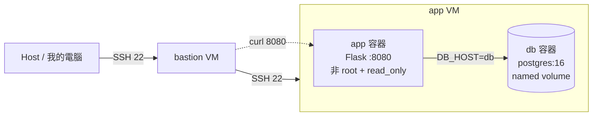
本次期末實作沿用期中建立的 `bastion → app` 架構，由 Host 端先連到 bastion VM，再透過 SSH 進入 app VM，所有服務都部署在 app VM 上，並使用 `compose.yaml` 宣告式管理 `app` 與 `db` 兩個 service。`app` 容器是自己 build 的 Flask 服務，監聽 8080 port，並透過 `DB_HOST=db` 連線到 PostgreSQL，`db` 容器使用 `postgres:16`，資料存放在 named volume，所以容器刪除與重建後資料仍可保留。

此架構的重點是把應用程式、資料庫和資料持久化分開處理。`bastion` 不做服務部署，只當跳板；`app` 容器負責 HTTP request 和 `/healthz` 健康檢查；`db` 容器負責資料儲存，並用 `pg_isready` 做 healthcheck，Compose 中設定 `depends_on` 搭配 `condition: service_healthy`，確保 app 會等 db 通過健康檢查後才啟動。

## 2. Part A：底座與基準點
這次期末實作是沿用期中已經做好的 `bastion → app` 架構，所以我一開始先確認從自己的 Windows Host 可以直接 SSH 進 app VM，我在 Windows PowerShell 執行：
```bash
ssh app
```

可以成功登入到 app VM，畫面最後顯示：
```bash
qaz@app:~$
```
- 代表 SSH config 裡面的 ProxyJump bastion 設定還是正常的，也表示 Host 可以透過 bastion 連到 app VM。

接著我在 app VM 裡確認 Docker 和 Docker Compose 的版本：
```bash
docker --version
docker compose version
```

實際輸出如下：

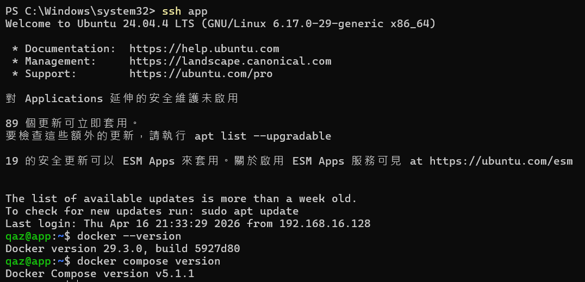

在正式開始修改 Dockerfile、Compose 和 volume 之前，我也先替 app VM 建立了一個 snapshot，名稱是 `final-baseline`，這個 snapshot 是這次實作的基準點，如果後面設定錯、容器壞掉或 volume 測試做亂，就可以回到這個狀態重新開始。

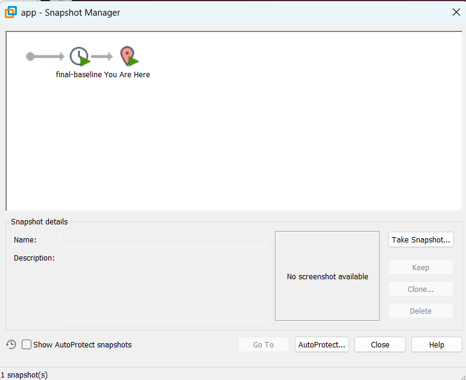

## 3. Part B：Dockerfile 與快取
這一部分我自己寫 [Dockerfile](app/Dockerfile)，把 Flask app 包成 image，這次的重點不是只有 build 成功，而是要讓 Dockerfile 的順序符合 W06 提到的 layer 快取原則，也就是「比較不常變的東西放前面，比較常改的程式碼放後面」。

這份 [Dockerfile](app/Dockerfile) 的順序是先複製 `requirements.txt`，再執行 `pip install`，最後才複製 `app.py`，這樣做的原因是 `requirements.txt` 比較少改，而 `app.py` 比較常改，依照 Docker layer cache 的規則，如果只改 `app.py`，前面的 `requirements.txt` 和 `pip install` 那幾層就不需要重新執行，可以直接使用快取。

### Build 快取對照
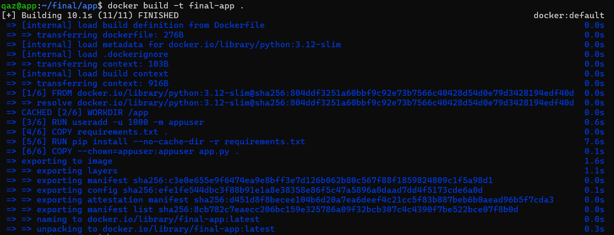

- 第一次 build 時，我執行：
  ```bash
  docker build -t final-app .
  ```
  - 第一次 build 會完整執行，包含下載 base image、建立使用者、安裝 Python 套件等步驟。我的第一次 build 時間大約是：`10.1s`
- 接著我只修改 `app.py` 的回應文字，將首頁輸出改成包含 `final app`，然後再次執行：
  ```bash
  docker build -t final-app .
  ```

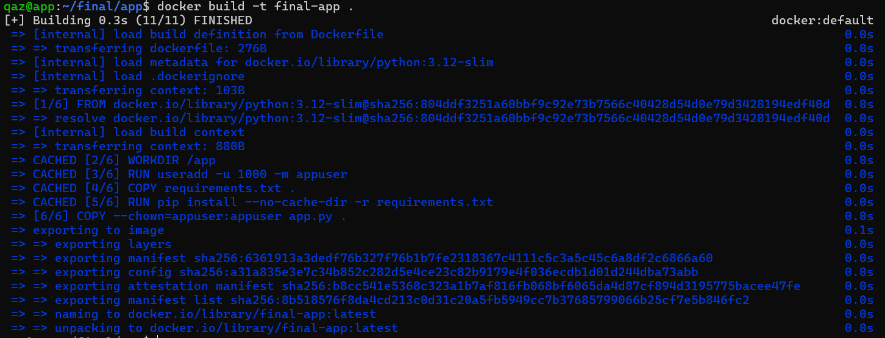

- 第二次 build 的結果可以看到 `pip install` 那一層有使用快取：
  ```text
  CACHED [5/6] RUN pip install --no-cache-dir -r requirements.txt
  ```
  - 第二次 build 時間大約是：`0.3s`

從兩次 build 的結果可以看出，Dockerfile 的 layer 排序有生效，因為我只改了 `app.py`，沒有改 `requirements.txt`，所以 `pip install` 那層的 cache key 沒有改變，Docker 可以直接使用 `CACHED`，不用重新安裝 Flask 和 psycopg2。

### 為什麼聽 8080 不聽 80？
這次 Flask app 設定監聽 8080，而不是 80，主要是因為權限問題，在 Linux 裡，1024 以下的 port 屬於 privileged port，一般情況下需要 root 權限或額外 capability 才能綁定，可是這次作業要求 app 容器不能用 root 跑，所以 Dockerfile 裡有建立 `appuser`，並用：
```dockerfile
USER appuser
```
切換成非 root 使用者，後面 Part D 還會加上 `cap_drop: [ALL]`，把容器的 capability 都拿掉，如果 app 還要綁定 80，就很可能因為權限不足而啟動失敗，所以我把 Flask app 改成監聽 8080，8080 是大於 1024 的 port，非 root 使用者可以正常綁定，也比較符合最小權限原則。

## 4. Part C：Compose 與資料持久化
這一部分我把原本單獨 build 的 Flask app，改成用 `compose.yaml` 管理 `app` 和 `db` 兩個 service，`app` 是自己寫 Dockerfile build 出來的 Flask 服務，`db` 則使用官方的 `postgres:16` image。

我的 `compose.yaml` 重點如下：
```yaml
services:
  db:
    image: postgres:16
    environment:
      POSTGRES_PASSWORD: ${DB_PASSWORD}
      POSTGRES_DB: ${DB_NAME}
    volumes:
      - db-data:/var/lib/postgresql/data
    healthcheck:
      test: ["CMD-SHELL", "pg_isready -U postgres -d $${POSTGRES_DB}"]
      interval: 5s
      timeout: 3s
      retries: 10
      start_period: 10s

  app:
    build: ./app
    ports:
      - "8080:8080"
    environment:
      DB_HOST: db
      DB_USER: postgres
      DB_PASSWORD: ${DB_PASSWORD}
      DB_NAME: ${DB_NAME}
    depends_on:
      db:
        condition: service_healthy

volumes:
  db-data:
```  
- 我把資料庫密碼和資料庫名稱放在 `.env`，避免直接寫死在 `compose.yaml` 裡面，繳交時不會交 `.env`，只交 `.env.example`：
  ```env
  DB_PASSWORD=change_me
  DB_NAME=finaldb
  ```
- 另外 `.gitignore` 有擋掉 `.env`：
  ```text
  .env
  __pycache__
  *.pyc
  ```
  這樣可以避免把真正的資料庫密碼一起交出去。

### Compose 啟動驗證
我在 `~/final` 執行：
```bash
docker compose up -d --build
docker compose ps
curl -s http://localhost:8080/
curl -s http://localhost:8080/healthz
```
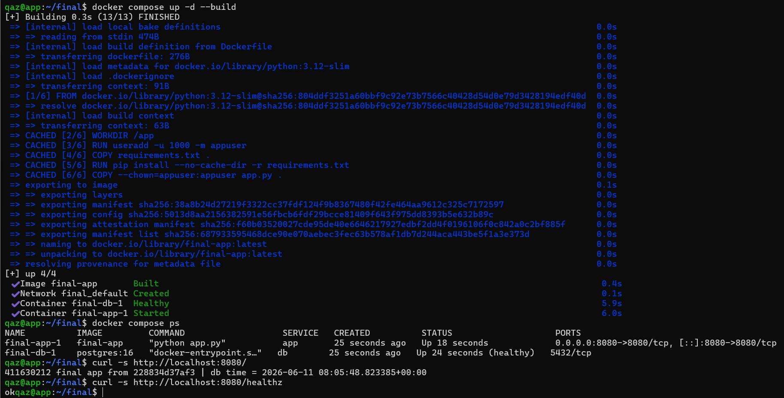

- 結果可以看到 `db` 是 `healthy`，`app` 也成功啟動，首頁也有回傳我的學號和資料庫時間，代表 app 已經成功連到 db：
  ```text
  411630212 final app from <container-id> | db time = ...
  ok
  ```

- 這裡 `db` 的 healthcheck 使用：
  ```yaml
  test: ["CMD-SHELL", "pg_isready -U postgres -d $${POSTGRES_DB}"]
  ```
  - 其中 `$${POSTGRES_DB}` 要寫成兩個 `$`，是因為 Compose 會先在 host 端展開變數，如果只寫 `${POSTGRES_DB}`，變數可能會在 host 端先被展開掉，導致容器內的 healthcheck 拿不到正確的資料庫名稱。

### 資料持久化三段對照
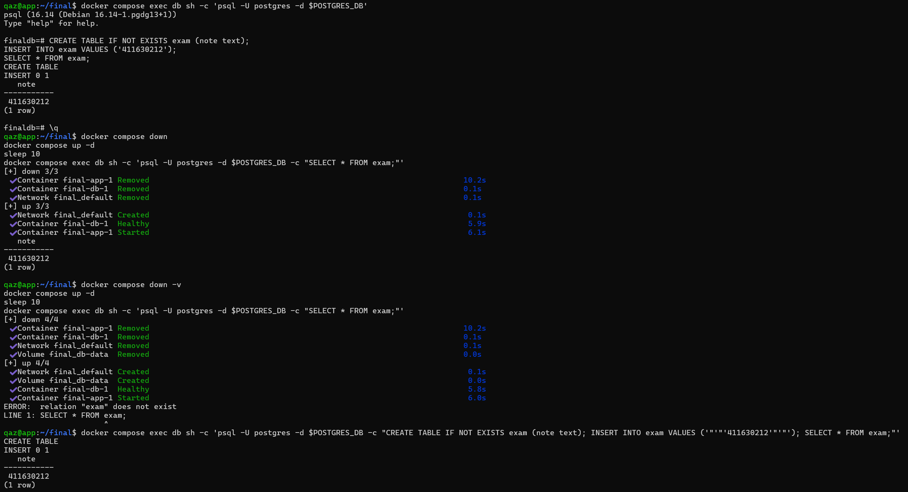

接著我測試 named volume 是否真的可以保留 PostgreSQL 的資料，我先進入 db 容器：
```bash
docker compose exec db sh -c 'psql -U postgres -d $POSTGRES_DB'
```
然後建立 `exam` table，並插入一筆包含我學號的資料：
```sql
CREATE TABLE IF NOT EXISTS exam (note text);
INSERT INTO exam VALUES ('411630212');
SELECT * FROM exam;
```
查詢結果可以看到資料已經寫入：`411630212`

---
第一段，我執行：
```bash
docker compose down
docker compose up -d
docker compose exec db sh -c 'psql -U postgres -d $POSTGRES_DB -c "SELECT * FROM exam;"'
```
結果資料還在，代表單純 `down` 只會刪除容器和 network，不會刪除 named volume。

---
第二段，我執行：
```bash
docker compose down -v
docker compose up -d
docker compose exec db sh -c 'psql -U postgres -d $POSTGRES_DB -c "SELECT * FROM exam;"'
```
這次查詢出現：
```text
ERROR:  relation "exam" does not exist
```
這代表 `down -v` 把 named volume 也一起刪掉了，所以原本存在 PostgreSQL 裡的 table 和資料都消失。

---
第三段，我重新建立 table 並重新插入學號：
```bash
docker compose exec db sh -c 'psql -U postgres -d $POSTGRES_DB -c "CREATE TABLE IF NOT EXISTS exam (note text); INSERT INTO exam VALUES ('"'"'411630212'"'"'); SELECT * FROM exam;"'
```
最後查詢結果又可以看到：`411630212`


### down vs down -v
`docker compose down` 和 `docker compose down -v` 最大的差別在於**會不會刪除 volume**。

- `docker compose down` 會刪除 Compose 建立的容器和 network，但不會刪除 named volume，所以 PostgreSQL 的資料還會留在 `db-data` 裡，也就是說，就算 db 容器被刪掉，只要 volume 還在，重新啟動 db 容器後資料仍然可以讀回來。
- `docker compose down -v` 則會連 named volume 一起刪除，這次 PostgreSQL 的資料是存在 `db-data` 裡，所以執行 `down -v` 後，`db-data` 被刪掉，資料庫資料也就一起消失。

所以 named volume 的生命週期不是跟單一容器綁定，而是獨立存在，容器可以刪除和重建，但 volume 只要沒有被明確刪除，資料就會繼續保留。

## 5. Part D：生產化加固
這一部分我把 [compose.yaml](/compose.yaml) 加上比較接近 production 的設定，主要包含四類：log rotation、資源上限、權限階梯和健康檢查，加固後也要確認服務還是可以正常跑，不能因為安全設定加太多導致 app 起不來。

我在 `app` service 加上的重點設定如下：
```yaml
healthcheck:
  test: ["CMD-SHELL", "python -c \"import urllib.request; urllib.request.urlopen('http://127.0.0.1:8080/healthz')\""]
  interval: 5s
  timeout: 3s
  retries: 5
  start_period: 10s

logging:
  driver: json-file
  options:
    max-size: "10m"
    max-file: "3"

mem_limit: 256m
cpus: "0.5"
pids_limit: 200

user: "1000:1000"
read_only: true
tmpfs:
  - /tmp
cap_drop:
  - ALL
security_opt:
  - no-new-privileges:true
```

`db` service 也有設定 log rotation 和資源上限：
```yaml
logging:
  driver: json-file
  options:
    max-size: "10m"
    max-file: "3"

mem_limit: 512m
cpus: "1.0"
pids_limit: 300
```

### 加固後服務狀態
套用設定後，我重新啟動整個 stack：
```bash
docker compose down
docker compose up -d --build
sleep 20
docker compose ps
curl -s http://localhost:8080/healthz
curl -s http://localhost:8080/
```
- 結果 `app` 和 `db` 都是 `Up` 且 `healthy`，`/healthz` 也回傳 `ok`，首頁仍然可以回傳學號與 db time，代表加固後服務仍可正常運作。

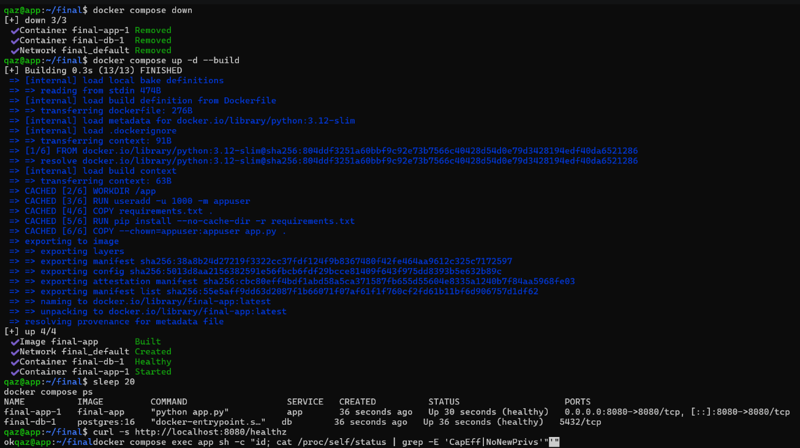

### 權限驗證
接著我進入 app 容器檢查執行身分與權限：
```bash
docker compose exec app sh -c "id; cat /proc/self/status | grep -E 'CapEff|NoNewPrivs'"
```

實際輸出重點如下：

```text
uid=1000 gid=1000 groups=1000
CapEff:	0000000000000000
NoNewPrivs:	1
```

這代表 app 容器不是用 root 身分執行，而是使用 uid 1000。`CapEff` 全部是 0，表示有效 capability 都被拿掉了，`NoNewPrivs: 1` 則表示容器內的程序不能再取得新的額外權限，符合最小權限原則。

### cgroup 取證
最後我從 `/sys/fs/cgroup/` 讀出 app 容器實際被 kernel 套用的資源限制：
```bash
PID=$(docker inspect --format='{{.State.Pid}}' $(docker compose ps -q app))
CGPATH=$(cat /proc/$PID/cgroup | head -1 | cut -d: -f3)

cat /sys/fs/cgroup$CGPATH/memory.max
cat /sys/fs/cgroup$CGPATH/cpu.max
cat /sys/fs/cgroup$CGPATH/pids.max
```

實際讀到的值如下：

| cgroup 檔案    |   讀到的值 | 對應 compose.yaml 設定 |
| ------------ | -------------: | ------------------ |
| `memory.max` |    `268435456` | `mem_limit: 256m`  |
| `cpu.max`    | `50000 100000` | `cpus: "0.5"`      |
| `pids.max`   |          `200` | `pids_limit: 200`  |

### 權限驗證輸出 + cgroup 三個檔案的讀值輸出圖片
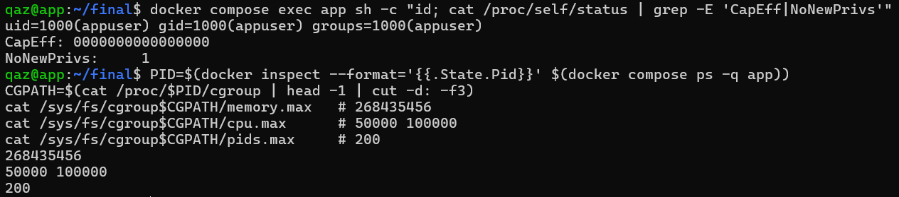

### yaml 的值怎麼對回 cgroup 檔案？
#### memory.max
`memory.max` 讀到的 `268435456` 是 byte 單位，我的 `compose.yaml` 裡面寫的是：
```yaml
mem_limit: 256m
```
換算方式是：
```text
256 × 1024 × 1024 = 268435456 bytes
```
所以 `memory.max = 268435456` 正好對應 `mem_limit: 256m`。

---
#### cpu.max
`cpu.max` 讀到的是：
```text
50000 100000
```
cgroup v2 的 `cpu.max` 格式是：
```text
quota period
```
也就是在一個週期 `period` 裡，最多可以使用多少 CPU 時間 `quota`。這裡是：
```text
50000 / 100000 = 0.5
```
所以代表 app 容器最多可以使用半顆 CPU，對應到 `compose.yaml` 裡的：
```yaml
cpus: "0.5"
```

---
#### pids.max
`pids.max` 讀到的是：
```text
200
```
這就直接對應到：
```yaml
pids_limit: 200
```
代表 app 容器裡最多只能建立 200 個 process，避免程式失控時產生太多程序拖垮主機。

## 6. Part E：故障演練
### 故障 1：F1 停止 db
- 注入方式：`docker compose stop db`
- 故障前：
  - 在故障前，先確認 `app` 和 `db` 都正常運作：
    ```bash
    docker compose ps
    curl -s -i http://localhost:8080/healthz
    ```
    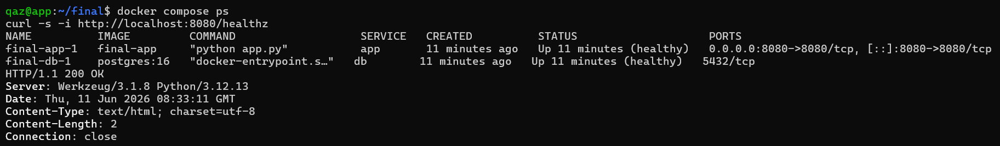

    - `docker compose ps` 顯示 `app` 和 `db` 都是 `Up`，而且狀態都是 `healthy`，`curl /healthz` 也回傳：
      ```
      HTTP/1.1 200 OK
      ok
      ```
      這代表故障前 app 可以正常連到 db，整個 stack 是正常的。
- 故障中：
  - 停止 db：
    ```bash
    docker compose stop db
    ```
    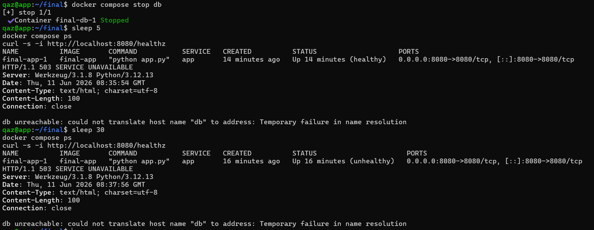
    
    - 停止 db 之後，重新檢查 `/healthz`：
      ```bash
      curl -s -i http://localhost:8080/healthz
      ```
      - 這時候 app 回傳：
        ```
        HTTP/1.1 503 SERVICE UNAVAILABLE
        db unreachable: ...
        ```
        這代表 app 服務本身還有回應 HTTP request，但是它已經無法連到 db。
    - 等待一段時間後，再次執行：
      ```bash
      docker compose ps
      curl -s -i http://localhost:8080/healthz
      ```
      這時候可以看到 `app` 容器仍然是 `Up`，但是狀態變成 `unhealthy`，而 `db` 已經停止，這表示 `unhealthy` 不等於容器死亡，而是 healthcheck 判斷服務狀態不正常。
- 回復後：
  - 重新啟動 db：
    ```bash
    docker compose start db
    ```
    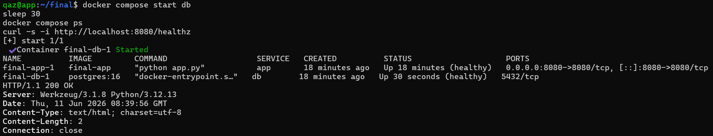
    
    - 等待 db 恢復 healthy 後，再檢查狀態：
      ```bash
      docker compose ps
      curl -s -i http://localhost:8080/healthz
      ```
      - 結果 `db` 回到 `Up (healthy)`，`app` 也恢復 `Up (healthy)`，`curl /healthz` 回到：
        ```
        HTTP/1.1 200 OK
        ok
        ```
- 診斷推論：
  - 這次故障的重點是 HTTP 503，HTTP 503 代表 app 的 HTTP server 本身還有收到 request，也有能力回應，只是它依賴的後端服務失敗，從錯誤內容 `db unreachable` 可以判斷問題發生在 app 到 db 的相依層，而不是 app process 死掉。

### 故障 2：F2 停止 app
- 注入方式：`docker compose stop app`
- 故障前：
  - 在故障前，先確認首頁可以正常回應：
    ```bash
    docker compose ps
    curl -s -i http://localhost:8080/
    ```
    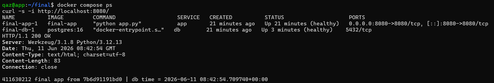
    
    - 當時 `app` 和 `db` 都是 `Up (healthy)`，首頁回傳：
      ```
      HTTP/1.1 200 OK
      411630212 final app from <container-id> | db time = ...
      ```
      這表示 app 正常啟動，而且可以成功連到 db 查詢時間。
- 故障中：
  - 停止 app：
    ```bash
    docker compose stop app
    ```
    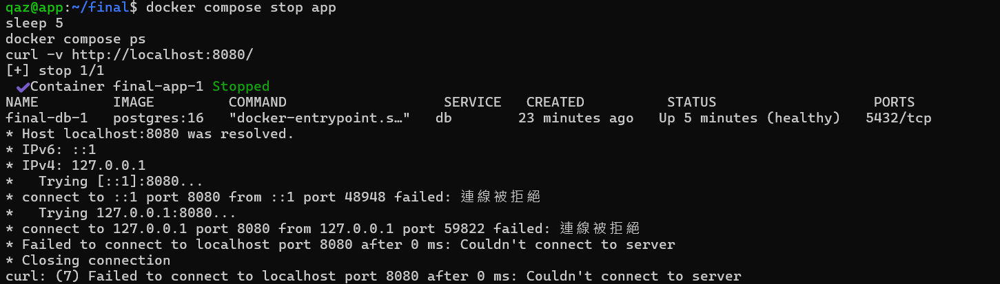

    - 再使用 `curl -v` 測試 8080 port：
      ```bash
      curl -v http://localhost:8080/
      ```
      - 結果出現 connection refused，畫面中可以看到類似：
        ```
        connect to 127.0.0.1 port 8080 failed: Connection refused
        curl: (7) Failed to connect to localhost port 8080
        ```
        此時 `docker compose ps` 顯示 db 還是 `Up (healthy)`，但是 app 已經停止，這表示這次不是 db 的問題，而是 app 服務本身沒有在 8080 port 監聽。
- 回復後：
  - 重新啟動 app：
    ```bash
    docker compose start app
    ```
    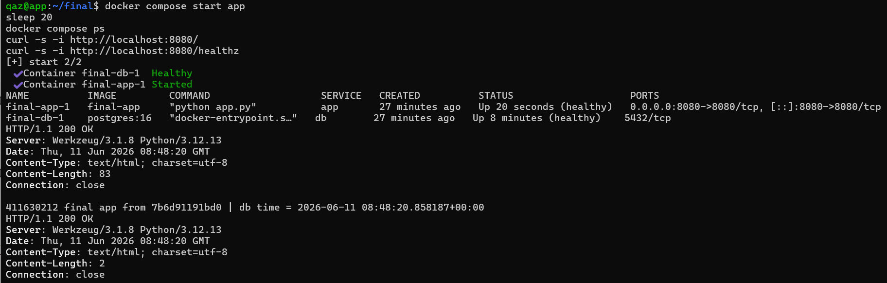

    - 等待 app 健康檢查恢復後，再次檢查：
      ```bash
      docker compose ps
      curl -s -i http://localhost:8080/
      curl -s -i http://localhost:8080/healthz
      ```
      - 結果 `app` 和 `db` 都恢復成 `Up (healthy)`。首頁回到 HTTP 200，也能看到學號和 db time；`/healthz` 也回到：
       ```
        HTTP/1.1 200 OK
        ok
        ```
- 診斷推論：
  - 這次故障的重點是 connection refused。connection refused 代表主機有回應，但是目標 port 沒有服務在監聽，和 F1 的 HTTP 503 不同，F1 至少 app 還有回應 HTTP；F2 則是 app 容器停止，所以 8080 port 沒有服務可以接收連線。

### 三症狀分層表
| 症狀 | 最可能的層 | 第一條驗證命令 |
| ---- | ---------- | -------------- |
| timeout | 網路層、路由、防火牆、VM 沒開，或 Host 到 bastion/app 不通，這種情況通常是連線封包沒有得到回應。 | `ping <目標 IP>` 或 `ssh -v app` |
| connection refused | 主機有通，但目標 port 沒有服務在監聽，常見原因是 app 容器停止、port 沒綁定，或服務沒有成功啟動。 | `docker compose ps` 或 `sudo ss -tlnp \| grep :8080` |
| HTTP 503 | HTTP server 本身有回應，但後端相依服務失敗，例如這次 F1 停止 db 後，app 還活著，但 `/healthz` 因為連不到 db 回 503。 | `curl -s -i http://localhost:8080/healthz` |

## 7. 反思
這學期從 VM 一路做到 production-ready 容器後，我覺得「隔離」不是只有一種意思，VM 的隔離比較像是把整台機器切開，每台 VM 有自己的作業系統、網卡和環境，所以主要是在防不同主機環境互相影響，namespace 則是容器層級的隔離，讓容器看到自己的 process、network、mount 等空間，看起來像獨立環境，但其實還是共用同一個 kernel，cgroup 防的是資源失控，例如記憶體、CPU 或 process 數量太多，避免一個容器拖垮整台主機，權限階梯則是防攻擊者打進容器後拿到太多權限，所以要用非 root、read_only、cap_drop 和 no-new-privileges 降低傷害範圍。

所以它們防的東西不完全一樣，VM 偏環境隔離，namespace 偏視野隔離，cgroup 偏資源隔離，權限階梯偏安全權限隔離，這次實作讓我比較清楚知道，production-ready 不是只有服務能跑，而是要在服務壞掉或被攻擊時，仍然能把影響範圍控制住。

## 8. Bonus
### Bonus 1｜Multi-stage 瘦身
我另外建立 `Dockerfile.multi`，把 build 過程分成 builder stage 和 runtime stage，builder stage 負責安裝 Python 套件到 `/install`，runtime stage 只複製 `/install` 和 `app.py`，因此最終 image 不會包含 builder stage 的其他內容。
```dockerfile
# ---------- builder stage ----------
FROM python:3.12-slim AS builder

WORKDIR /build

COPY requirements.txt .

RUN pip install --no-cache-dir --prefix=/install -r requirements.txt

# ---------- runtime stage ----------
FROM python:3.12-slim AS runtime

WORKDIR /app

RUN useradd -u 1000 -m appuser

COPY --from=builder /install /usr/local
COPY --chown=appuser:appuser app.py .

USER appuser

EXPOSE 8080

CMD ["python", "app.py"]
```

我使用以下指令 build multi-stage image：
```bash
docker build -f Dockerfile.multi -t final-app:multi .
docker images | grep final-app
```
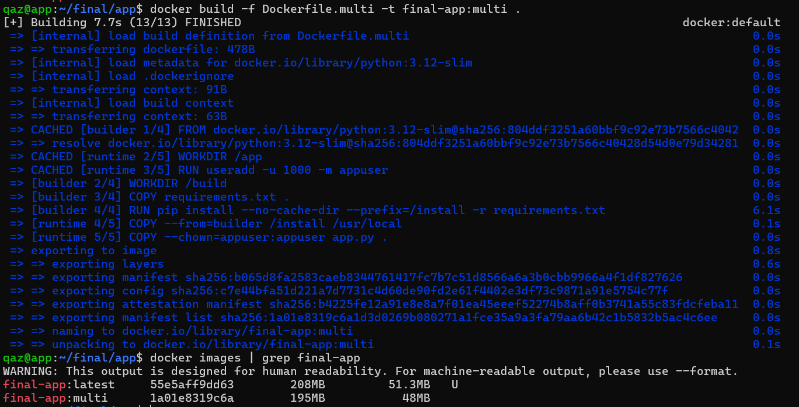

大小對照如下：
| Image              | 說明                     |  SIZE |
| ------------------ | ---------------------- | ----: |
| `final-app:latest` | 單階段 Dockerfile         | 208MB |
| `final-app:multi`  | multi-stage Dockerfile | 195MB |

可以看到 multi-stage 版本從 208MB 降到 195MB，少了約 13MB，這次差距沒有非常大，主要是因為這個 Flask app 的依賴不多，而且 builder 和 runtime 都使用 `python:3.12-slim`，不過 multi-stage 的重點是 builder stage 不會進入最終 image，最後產生的 image 只保留 runtime stage 需要的檔案。

接著我用 `docker run` 測試 `final-app:multi` 是否可以正常連到 Compose 裡的 db：
```bash
docker run -d --name final-app-multi-test \
  --network final_default \
  -p 8081:8080 \
  -e DB_HOST=db \
  -e DB_USER=postgres \
  -e DB_PASSWORD=finalpass \
  -e DB_NAME=finaldb \
  final-app:multi

curl -s http://localhost:8081/
curl -s http://localhost:8081/healthz
docker exec final-app-multi-test id
```
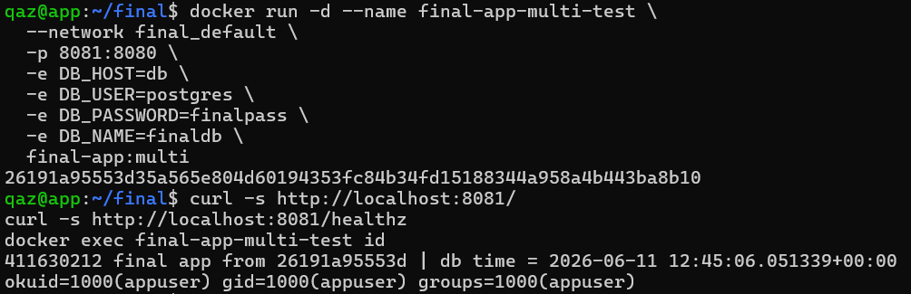

測試結果顯示首頁可以正常回傳學號與 db time，`/healthz` 回傳 `ok`，而且容器內的 uid 是 `1000(appuser)`，代表 multi-stage image 也不是用 root 執行。

####  builder 層去了哪裡？
multi-stage build 的最終 image 只會保留最後一個 runtime stage 的內容，這次 builder stage 負責安裝 Python 套件到 `/install`，runtime stage 則只用：
```dockerfile
COPY --from=builder /install /usr/local
```
把需要的執行期檔案搬到最終 image，因此 builder stage 裡面不需要的中間內容不會進入 `final-app:multi`。

不過 builder stage 並不是完全從本機消失，它仍可能存在於 Docker 的 build cache 或沒有正式 tag 的 image 中，之後重新 build 時可以被快取重用，我用下面指令查看本機 image：
```bash
docker images -a | head -20
```
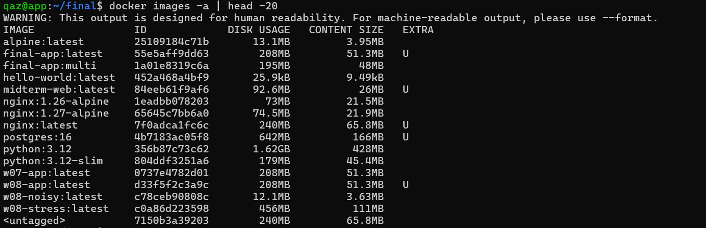

輸出中可以看到 `final-app:latest`、`final-app:multi` 的大小對照，也可以看到 `<untagged>` 這類沒有正式 tag 的 image/cache 內容，這代表 builder 或中間產物不會成為最終 image 的一部分，但本機仍可能保留相關快取。

### Bonus 2｜Namespace 取證
這一部分我用 `/proc/<PID>/ns/` 來證明 app 和 db 兩個容器活在不同的 namespace 裡，雖然它們都跑在同一台 app VM 上，但 Docker 會透過 Linux namespace 讓每個容器有不同的系統視野。

我先用 `docker inspect` 找出 app 和 db 兩個容器在 host 上對應的 PID：
```bash
PID_APP=$(docker inspect --format='{{.State.Pid}}' $(docker compose ps -q app))
PID_DB=$(docker inspect --format='{{.State.Pid}}' $(docker compose ps -q db))
echo "PID_APP=$PID_APP"
echo "PID_DB=$PID_DB"
```
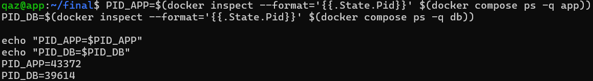

實際取得的 PID 如下：
```
PID_APP=43372
PID_DB=39614
```

接著查看兩個 PID 對應的 namespace 連結：
```bash
sudo ls -l /proc/$PID_APP/ns/
sudo ls -l /proc/$PID_DB/ns/
```
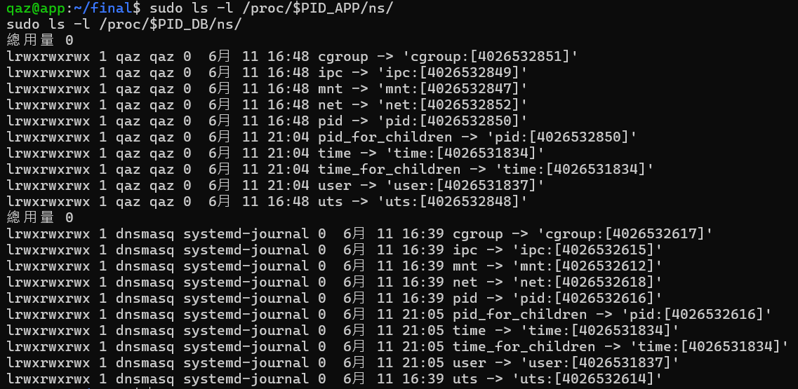

從輸出可以看到 app 和 db 的 mnt、net、pid namespace 編號都不同：
| Namespace |          app |           db | 是否不同 | 說明                                      |
| :---------: | :-----------: | :-----------: | :----: | :---------------------------------------: |
| `mnt`     | `4026532847` | `4026532612` | 不同   | mount namespace 不同，代表兩個容器看到的檔案系統掛載視野不同  |
| `net`     | `4026532852` | `4026532618` | 不同   | network namespace 不同，代表兩個容器有各自的網路 stack |
| `pid`     | `4026532850` | `4026532616` | 不同   | PID namespace 不同，代表兩個容器看到的 process 空間不同 |

這跟 W05 提到的「容器不是輕量 VM」有關，VM 通常有自己的 kernel，而容器沒有自己的 kernel；app 和 db 容器其實都是 app VM 上的 process，只是 Docker 用 namespace 把 process、network、mount 等視野隔開，所以容器看起來像獨立環境，但本質上不是完整 VM，而是共用同一個 Linux kernel 的隔離 process。
