# 期中實作 — 411630212 黃鈞琳

## 1. 架構與 IP 表
### 架構圖
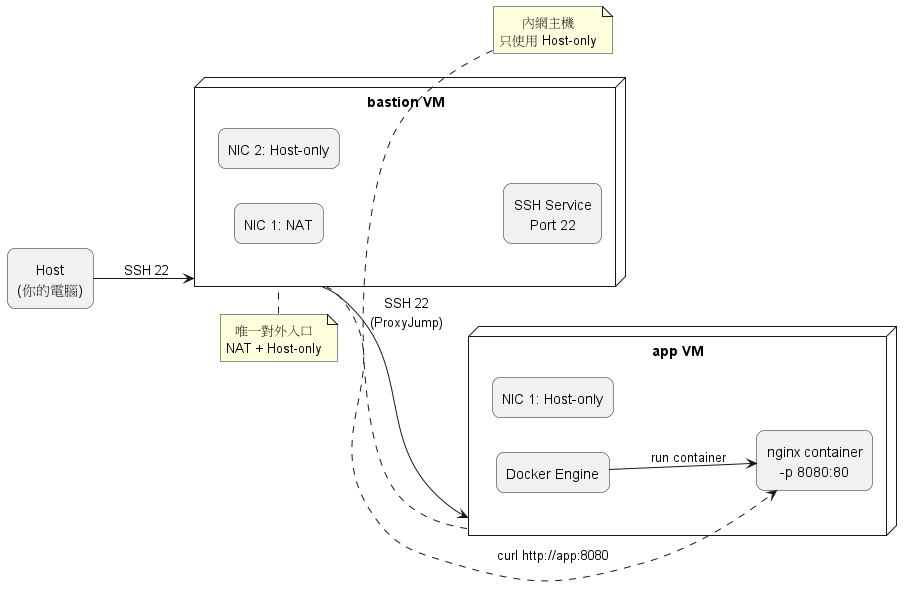

### IP 表
| VM | 介面用途 | IP |
|---|---|---|
| bastion | NAT | 192.168.71.130 |
| bastion | Host-only | 192.168.16.128 |
| app | Host-only | 192.168.16.131 |

## 2. Part A：VM 與網路
### Step 1: 確認並設定主機名稱
- 在 bastion 那台執行
  ```bash
  sudo hostnamectl set-hostname bastion
  hostnamectl
  ```
- 在 app 那台執行
  ```bash
  sudo hostnamectl set-hostname app
  hostnamectl
  ```

#### 預期結果
- 在輸出中可看到：`Static hostname: bastion` 或 `Static hostname: app`
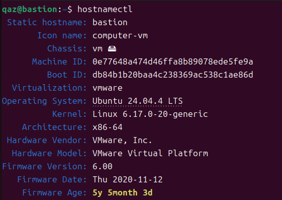
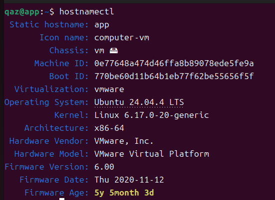

### Step 2: 設定 VM 網卡（VMware GUI）
- bastion
    - Network Adapter 1：NAT
    - Network Adapter 2：Host-only
- app
    - 只保留 Host-only

### Step 3: 重新啟動 VM
網卡調整後，建議重新開機：
```bash
sudo reboot
```
兩台都做一次。

### Step 4: 確認 IPv4 位址
#### 在 bastion 執行
```bash
ip -4 addr show
```

#### 預期結果
應看到 2 組 IPv4：
- 一組 NAT IP
- 一組 Host-only IP

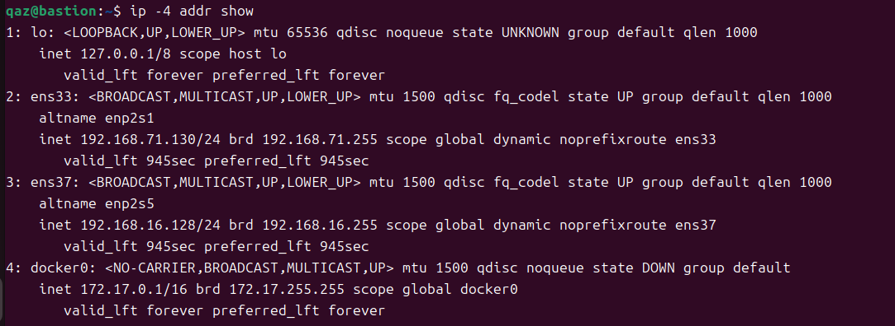

#### 在 app 執行
```bash
ip -4 addr show
```

#### 預期結果
- 應只看到 1 組 Host-only IPv4

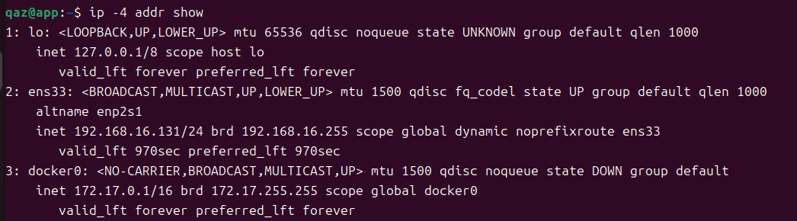

### Step 5: 確認 Host-only 網段一致
#### bastion
```
ens33 → 192.168.71.130  ( NAT )
ens37 → 192.168.16.128  ( Host-only )
```

#### app
```
ens33 → 192.168.16.131  ( Host-only )
```

#### 網段檢查（關鍵）
```
bastion Host-only → 192.168.16.128
app Host-only     → 192.168.16.131
```
- 兩台 VM 的 Host-only 介面皆位於 192.168.16.0/24 子網，因此可透過 L3（IP 層）直接通訊，無需經過 NAT。

### Step 6: 互 ping 驗證
#### bastion → app
```bash
ping -c 3 192.168.16.131
```
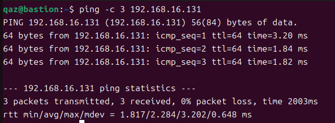

#### app → bastion
```bash
ping -c 3 192.168.16.128
```
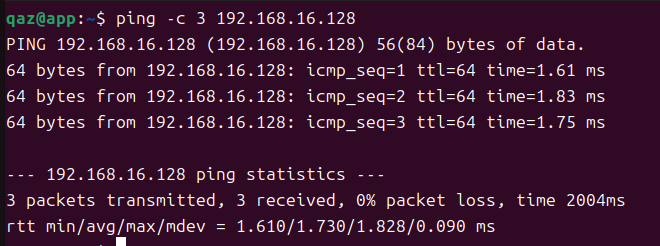

## 3. Part B：金鑰、ufw、ProxyJump
### 防火牆規則表

| 主機 | 預設策略 | 允許規則 |
|------|--------|----------|
| bastion | deny incoming | allow 22/tcp |
| app | deny incoming | allow 22/tcp from 192.168.16.128 |

### ssh app 成功證據
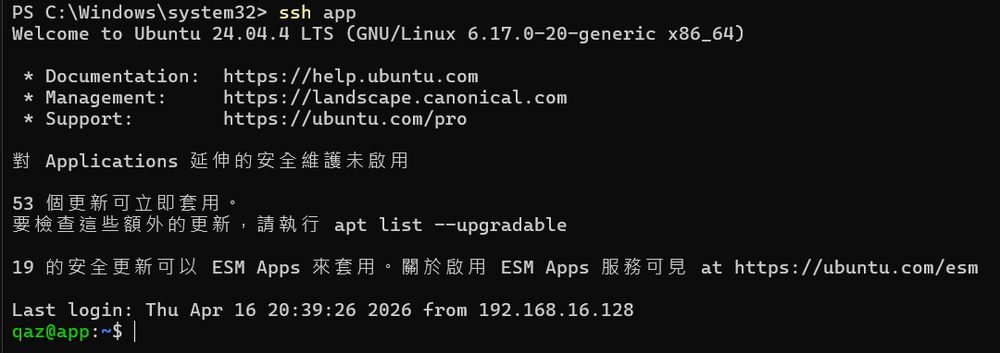

## 4. Part C：Docker 服務
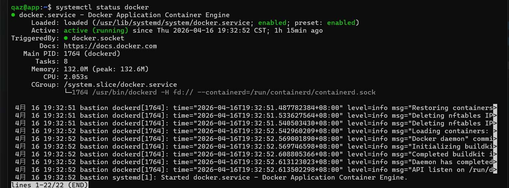
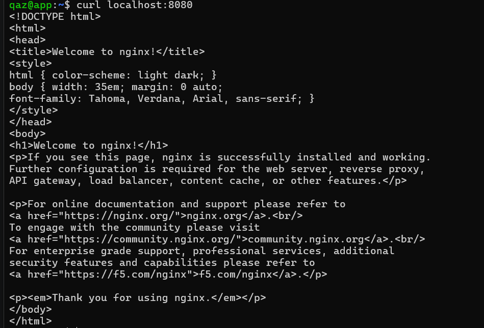

## 5. Part D：故障演練
### 故障 1: F1
- 注入方式：
  ```bash
  sudo ip link set ens33 down
  ```
  
- 故障前：
  ```bash
  ping -c 3 192.168.16.131
  ```
  - 可正常回應。
  
  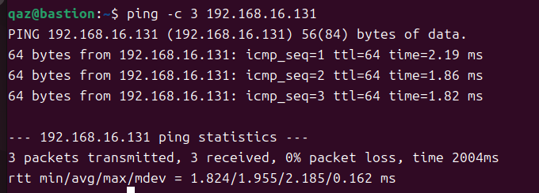

- 故障中：
  ```bash
  ssh app
  ```
  - 出現 "No route to host"。
  
  ```bash
  ping -c 3 192.168.16.131
  ```
  - 顯示 "Destination Host Unreachable"。
  
  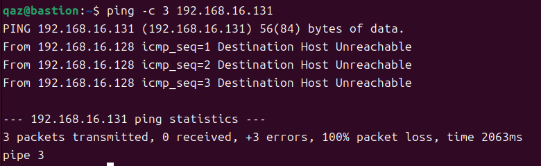

- 回復後：
  ```bash
  sudo ip link set ens33 up
  ```
  - 再次測試：
    ```bash
    ping -c 3 192.168.16.131
    ```
    - 恢復正常。
  
    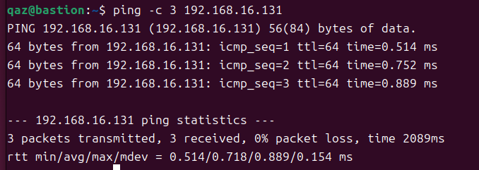
  
- 診斷推論：在故障中，ping 顯示 "Destination Host Unreachable"，ssh 則出現 "No route to host"，此代表來源主機在網路層（L3）即判斷無法到達目標，封包尚未成功送出，因此可判斷為網卡關閉所導致的網路層故障，而非防火牆阻擋，此情況與 timeout 本質相同，皆為網路無法到達目標主機。

### 故障 2: F2
- 注入方式：
  ```bash
  sudo ufw delete 1
  sudo ufw default deny incoming
  ```
  - 確認：
    ```bash
    sudo ufw status verbose
    ```
    - 確認輸出中未出現任何 `22/tcp ALLOW` 規則。
    
- 故障前：
  ```bash
  ssh app
  ```
  - 成功登入。

  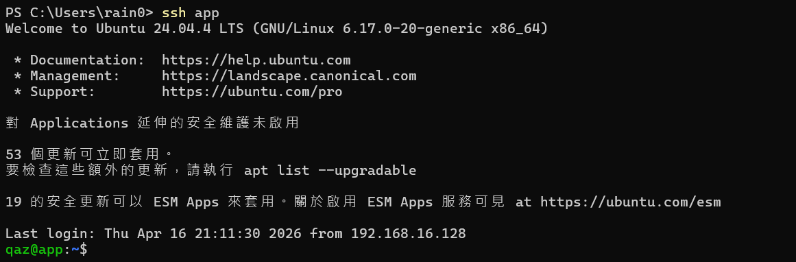

- 故障中：
  ```bash
  ssh app
  ```
  - 出現 "Connection timed out"。

  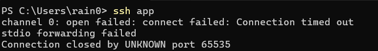
  ```bash
  ping -c 3 192.168.16.131
  ```
  - 仍然成功。
    
  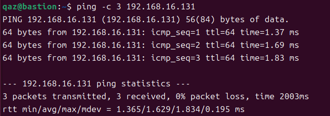

- 回復後：
  ```bash
  sudo ufw allow from 192.168.16.128 to any port 22 proto tcp
  ```
  - 再次測試：
    ```bash
    ssh app
    ```
    - 恢復正常登入。

    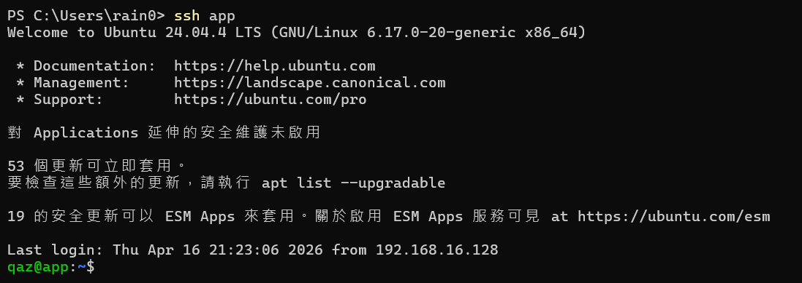
  
- 診斷推論：在故障中，ping 可正常回應，但 ssh 連線失敗，表示網路層（L2/L3）仍然正常，但 SSH 服務所使用的 port 22 被防火牆阻擋，因此可判斷為防火牆（L4/Policy）問題，與 F1 網路中斷（ping 失敗）不同。

### 症狀辨識（若選 F1+F2 必答）
雖然 F1（網卡關閉）與 F2（防火牆阻擋）在 SSH 都可能出現 timeout，但可透過網路層測試進行區分：

- 使用 `ping`
  - 若 **ping 失敗（Destination Host Unreachable / No route to host）**  
    - 表示封包在 L3 即無法送出，屬於「網路層問題」（F1）
  - 若 **ping 正常，但 SSH timeout**  
    - 表示 L3 正常，但特定 port（22）被阻擋，屬於「防火牆/Policy 問題」（F2）

因此關鍵在於判斷「封包有沒有成功到達目標主機」，而不只是看 timeout。

## 6. 反思（200 字）
這次實作讓我對「分層隔離」有更實際的理解，以前會覺得只要連不上就是系統壞掉，但實際操作後才發現，不同層出問題，現象其實不一樣。像 F1 網卡關閉時，連 ping 都不通，甚至會出現「No route to host」或「Destination Host Unreachable」，代表問題在網路層；但 F2 防火牆時，ping 還是正常，只有 SSH timeout，表示是上層服務被阻擋，這也讓我理解「timeout 不等於壞掉」，而是需要進一步判斷封包到底有沒有送到，透過簡單的工具（像 ping）就可以快速區分問題是在網路還是防火牆。這種從現象去推回原因的過程，比單純背指令更重要，也比較像實際在做系統排錯。

## 7. Bonus（選做）
### Bonus 1: Dockerfile 優化
#### Dockerfile
```dockerfile
FROM nginx:alpine
COPY index.html /usr/share/nginx/html/index.html
EXPOSE 80
```
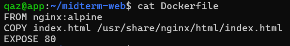

#### .dockerignore
```
.git
node_modules
*.log
```
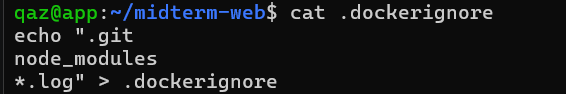

#### docker history
```bash
docker history midterm-web
```
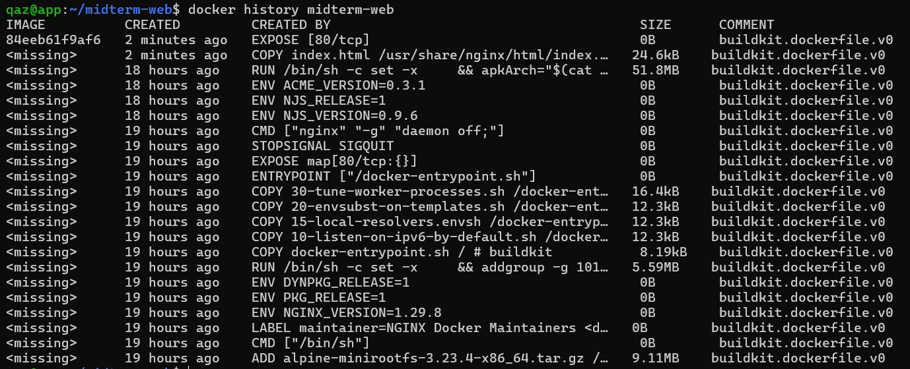

#### 驗證（從 bastion）
```bash
curl http://192.168.16.131:8081
```
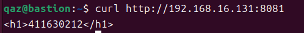
- 顯示學號頁面。

#### Layer 說明
- FROM nginx:alpine
  - 建立 base layer，提供輕量化 nginx HTTP server 環境。
- COPY index.html
  - 建立 application layer，將自訂網頁覆蓋 nginx 預設首頁。
- EXPOSE 80
  - 宣告容器內使用的 port，方便後續對外映射。

#### 為什麼 COPY 要放在 FROM 後面（快取考量）
Docker build 採用 layer cache 機制，每一行指令都會形成一層，將 COPY 放在 FROM 之後，可以確保：

- base image（nginx:alpine）只會下載一次
- 若 index.html 修改，只需重新 build COPY 層
- 不會重新執行前面的步驟（例如: 拉 image）

因此可以大幅提升 build 效率與開發速度。

### Bonus 2: Cgroup 限制觀察
#### 啟動記憶體受限的 container
```bash
docker run -d --name limited --memory=64m nginx
```

#### 查看 inspect 資訊
```bash
docker inspect limited | grep -i -E 'memory|cgroup'
```
- 可觀察到 Memory 設定。
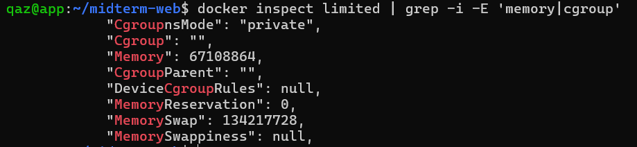

#### 確認系統使用 cgroup v2
```bash
stat -fc %T /sys/fs/cgroup
```
- 輸出：`cgroup2fs`

#### 取得 container ID 並找到 cgroup 路徑
```bash
docker inspect -f '{{.Id}}' limited
sudo find /sys/fs/cgroup -name "*$(docker inspect -f '{{.Id}}' limited)*"
```

#### 讀取記憶體限制
```bash
cat /sys/fs/cgroup/system.slice/docker-$(docker inspect -f '{{.Id}}' limited).scope/memory.max
```
- 輸出：`67108864`
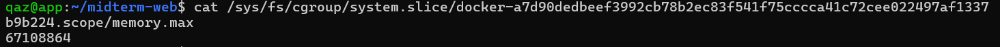

#### 說明
- `64m = 67108864 bytes`
- Docker 透過 cgroup（memory.max）將記憶體限制交由 Linux kernel enforce
