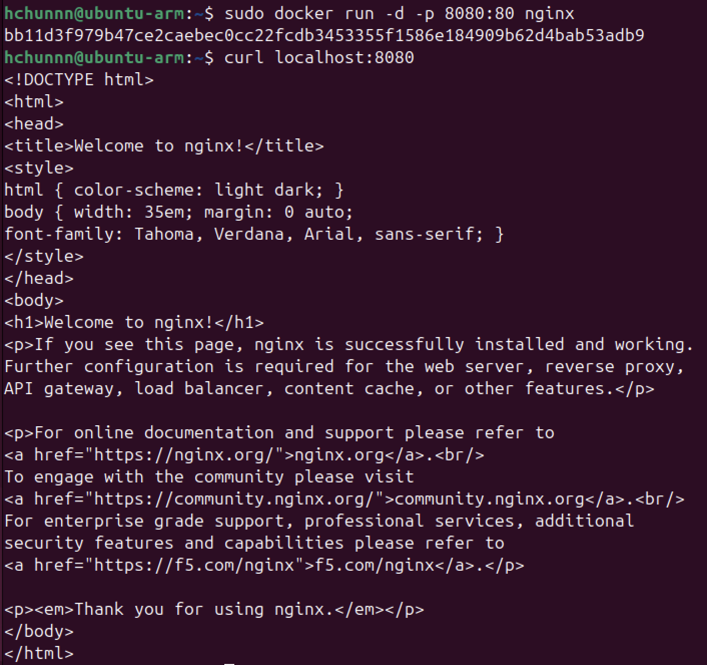
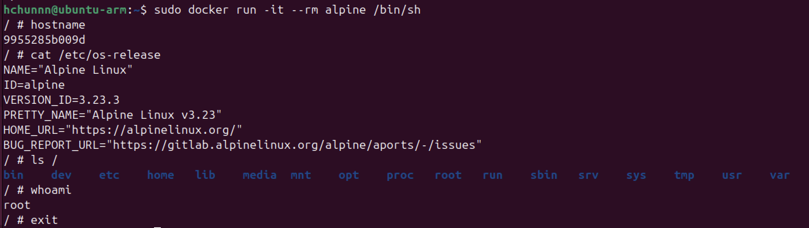
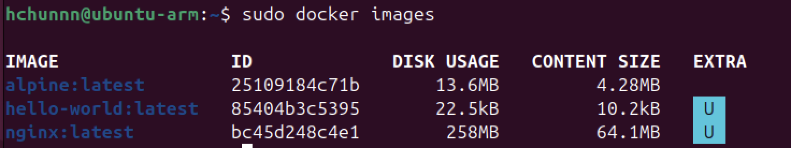

# W01｜虛擬化概論、環境建置與 Snapshot 機制

## 環境資訊
- Host OS：macOS 14
- VM 名稱：ubuntu-arm
- Ubuntu 版本：
  ```
  Distributor ID: Ubuntu
  Description:    Ubuntu 24.04.4 LTS
  Release:        24.04
  Codename:       noble
  ```
- Docker 版本：`Docker version 29.3.0, build 5927d80`
- Docker Compose 版本：`Docker Compose version v5.1.0`

## VM 資源配置驗證

| 項目 | VMware 設定值 | VM 內命令 | VM 內輸出 |
|---|---|---|---|
| CPU | 2 vCPU | `lscpu \| grep "^CPU(s)"` | `CPU(s):4` |
| 記憶體 | 4 GB | `free -h \| grep Mem` | `Mem:   3.8Gi   1.1Gi   636Mi    29Mi   2.3Gi   2.7Gi` |
| 磁碟 | 40 GB | `df -h /` | `/dev/mapper/ubuntu--vg-ubuntu--lv   30G   12G   17G  43% /` |
| Hypervisor | VMware | `lscpu \| grep Hypervisor` | qemu |

## 四層驗收證據
- [X] ① Repository：`cat /etc/apt/sources.list.d/docker.list` 輸出
  ```
  deb [arch=arm64 signed-by=/etc/apt/keyrings/docker.gpg]   https://download.docker.com/linux/ubuntu   noble stable
  ```
- [X] ② Engine：`dpkg -l | grep docker-ce` 輸出
  ```
  ii  docker-ce                    5:29.3.0-1~ubuntu.24.04~noble   arm64
  ii  docker-ce-cli                5:29.3.0-1~ubuntu.24.04~noble   arm64
  ii  docker-ce-rootless-extras    5:29.3.0-1~ubuntu.24.04~noble   arm64
  ```
- [X] ③ Daemon：`sudo systemctl status docker` 顯示 active
  ```
  ● docker.service - Docker Application Container Engine
       Loaded: loaded (/usr/lib/systemd/system/docker.service; enabled; preset: e>
       Active: active (running) since Thu 2026-03-12 11:14:03 CST; 30min ago
  TriggeredBy: ● docker.socket
         Docs: https://docs.docker.com
     Main PID: 4421 (dockerd)
        Tasks: 12
       Memory: 34.2M (peak: 66.9M)
          CPU: 3.110s
       CGroup: /system.slice/docker.service
             └─4421 /usr/bin/dockerd -H fd:// --containerd=/run/containerd/cont
  ```
- [X] ④ 端到端：`sudo docker run hello-world` 成功輸出
  ```
  Hello from Docker!
  This message shows that your installation appears to be working correctly.
  ```
- [X] Compose：`docker compose version` 可執行
  ```
  Docker Compose version v5.1.0
  ```

## 容器操作紀錄
- [X] nginx：`sudo docker run -d -p 8080:80 nginx` + `curl localhost:8080` 輸出
  
- [X] alpine：`sudo docker run -it --rm alpine /bin/sh` 內部命令與輸出
  
- [X] 映像列表：`sudo docker images` 輸出
  

## Snapshot 清單

| 名稱 | 建立時機 | 用途說明 | 建立前驗證 |
|---|---|---|---|
| clean-baseline | Ubuntu 建置完成並通過 Docker 四層驗證後 | 建立第一個可回復基線，建 snapshot 之前必須先確認環境健康 | `hostnamectl`、`ip route`、`docker --version`、`docker compose version`、`sudo systemctl status docker --no-pager`、`sudo docker run --rm hello-world`（全部通過才建點）|
| docker-ready | 完成 nginx 與 alpine 容器操作實驗後 | 已經有完整容器環境，可以直接進行服務測試 | `sudo systemctl status docker --no-pager`、`sudo docker run --rm hello-world`、`sudo docker images（確認 nginx、alpine 映像都在）|

## 故障演練三階段對照

| 項目 | 故障前（基線） | 故障中（注入後） | 回復後 |
|---|---|---|---|
| docker.list 存在 | 是 | 否 | 是 |
| apt-cache policy 有候選版本 | 是 | 否 | 是 |
| docker 重裝可行 | 是 | 否 | 是 |
| hello-world 成功 | 是 | N/A | 是 |
| nginx curl 成功 | 是 | N/A | 是 |

## 手動修復 vs Snapshot 回復

| 面向 | 手動修復 | Snapshot 回復 |
|---|---|---|
| 所需時間 | 大約幾秒鐘到幾分鐘（要看故障複雜的程度） | 大約幾秒鐘而已（因為只要 VM 關機後 → Snapshot Manager → 選 docker-ready → Revert → 開機） |
| 適用情境 | 小問題或是設定錯誤時（可以精準修復單一元件） | 系統被破壞或是環境混亂，需要快速回到穩定狀態時 |
| 風險 | 可能會修錯設定或遺漏某些步驟，導致問題不能完全解決 | 會回到舊狀態，snapshot 之後的變更會全部消失 |

## Snapshot 保留策略
- 新增條件：完成一個重要的階段或系統狀態穩定時建立（例如：OS 安裝完成、Docker 安裝完成、容器環境完成）。
- 保留上限：最多 3 個活躍 snapshot。
- 刪除條件：當 snapshot 超過保留上限，或該實驗階段已經不需要時刪除較舊的 snapshot。

## 最小可重現命令鏈
```
# 1. 故障前基線（確認 Docker repo 正常）
echo "=== 故障前 ==="
ls /etc/apt/sources.list.d/
apt-cache policy docker-ce | head -10

# 2. 故障注入（移走 Docker repository）
sudo rm /etc/apt/sources.list.d/docker.list

# 3. 更新套件清單
sudo apt update

# 4. 觀測故障證據
echo "=== 故障中 ==="
ls /etc/apt/sources.list.d/
apt-cache policy docker-ce | head -10

# 5. 嘗試安裝 Docker（會失敗）
sudo apt -y install docker-ce 2>&1 | tail -5

# 6. 回復環境
# 6.1 手動修復
sudo mv /etc/apt/sources.list.d/docker.list.broken /etc/apt/sources.list.d/docker.list
sudo apt update
apt-cache policy docker-ce | head -5
# 6.2 關機回復到 docker-ready
sudo poweroff

# 7. 回復後完整驗證
echo "=== 回復後 ==="
ls /etc/apt/sources.list.d/
cat /etc/apt/sources.list.d/docker.list
sudo apt update

# 8. Docker 功能驗證
sudo systemctl status docker --no-pager
sudo docker --version
docker compose version
sudo docker run --rm hello-world
sudo docker images

free -h
df -h /
```

## 排錯紀錄
- 症狀：
  嘗試重新安裝 Docker 時失敗，`apt-cache policy docker-ce` 顯示 `Candidate: (none)`，系統沒辦法找到 docker-ce 套件來源。
- 診斷：
  先檢查 Docker repository 設定：
  ```
  ls /etc/apt/sources.list.d/
  apt-cache policy docker-ce | head -10
  ```
  發現 docker.list 檔案不存在，推測 Docker repository 被移除，導致 apt 無法取得 docker-ce 套件。
- 修正：
  透過 snapshot 回復系統至 `clean-baseline` 或 `docker-ready` 狀態，使 `/etc/apt/sources.list.d/docker.list` 恢復。
- 驗證：
  重新檢查 repository 與 Docker 功能：
  `cat /etc/apt/sources.list.d/docker.list`、
  `apt-cache policy docker-ce`、
  `sudo docker run --rm hello-world`
  確認 docker-ce 有 candidate，且 hello-world 容器成功執行。

## 設計決策
我在本週課程選擇使用 Snapshot 作為主要的系統回復機制，而不是完全依賴手動修復！
因為 Snapshot 可以在系統環境被破壞的時候快速回復到已知的穩定狀態，大大降低了排錯的時間。在本週的實作中，當移走 Docker repository 後，系統無法取得 docker-ce 套件來源，導致 `apt-cache policy docker-ce` 顯示 `Candidate: (none)`。
如果採用手動修復，需要重新加入 repository、更新套件列表並再次驗證，步驟較多並且容易出錯。
如果透過 Snapshot 回復，只需要將 VM 回復至 `clean-baseline` 或 `docker-ready` 節點就可以立即恢復完整環境。但缺點是 Snapshot 會佔用較多磁碟空間，並且回復後會失去 snapshot 建立之後的變更。
所以在本週實作，Snapshot 適合用於快速回復與測試，但是在正式系統中還是需要搭配手動排錯與設定管理工具！
