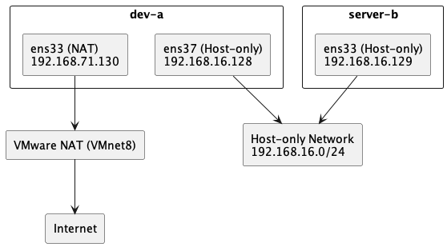

# W02｜VMware 網路模式與雙 VM 排錯

## 網路配置

| VM | 網卡 | 模式 | IP | 用途 |
|---|---|---|---|---|
| dev-a | NIC 1 | NAT | 192.168.71.130 | 上網 |
| dev-a | NIC 2 | Host-only | 192.168.16.128 | 內網互連 |
| server-b | NIC 1 | Host-only | 192.168.16.129 | 內網互連 |

## 連線驗證紀錄

- [X] dev-a NAT 可上網：`ping google.com` 輸出

  
- [X] 雙向互 ping 成功：貼上雙方 `ping` 輸出

  
  
- [X] SSH 連線成功：`ssh <user>@<ip> "hostname"` 輸出

  
- [X] SCP 傳檔成功：`cat /tmp/test-from-dev.txt` 在 server-b 上的輸出

  
  
- [X] server-b 不能上網：`ping 8.8.8.8` 失敗輸出

  

## 故障演練一：介面停用

| 項目 | 故障前 | 故障中 | 回復後 |
|---|---|---|---|
| server-b 介面狀態 | UP | DOWN | UP |
| dev-a ping server-b | 成功 | 失敗 | 成功 |
| dev-a SSH server-b | 成功 | 失敗 | 成功 |

## 故障演練二：SSH 服務停止

| 項目 | 故障前 | 故障中 | 回復後 |
|---|---|---|---|
| ss -tlnp grep :22 | 有監聽 | 無監聽 | 有監聽 |
| dev-a ping server-b | 成功 | 成功 | 成功 |
| dev-a SSH server-b | 成功 | Connection refused | 成功 |

## 排錯順序
* 依照教材的步驟，採用由下而上（L2 → L3 → L4）的分層排錯方式，依序驗證網路連線的狀態，以快速定位問題的來源。

### L2
* 首先要檢查網路介面是否存在而且為啟用狀態，並且確認是否取得正確的 IP 位址。
* 使用指令：
  ```bash
  ip address show
  ip link show
  ```
  > 如果發現介面為 DOWN 或是未取得 IPv4 位址，表示問題發生於 L2，需要檢查網卡設定或是重新啟用介面。

### L3
* 在確認網卡正常後，檢查主機是否位於同一子網，並且確認路由設定是否正確，再透過 ping 測試連通性。
* 使用指令：
  ```bash
  ip route show
  ping -c 4 <對端IP>
  ```
  > 如果 ping 無法成功，表示 L3 存在問題，可能的原因包括 IP 設定錯誤、子網不一致或是缺少路由。

### L4
* 在確認網路可 ping 成功後，檢查應用服務是否正常運作，例如: SSH 是否在監聽 port 22。
* 使用指令：
  ```bash
  ss -tlnp | grep :22
  ssh <user>@<ip> "hostname"
  ```
  > 如果 ping 成功但是 SSH 顯示「Connection refused」，表示 L4 層發生問題，需要確認 SSH 服務是否啟動。

## 網路拓樸圖


## 排錯紀錄
- 症狀：在確認雙 VM 的 Host-only 連線時，發現 server-b 的網路介面一開始看起來只有 IPv6 位址，未明確看到可用的 IPv4，導致沒辦法立刻確認其是否已經正確連入 Host-only 的網路，因此暫時沒辦法進行後續的 ping 與 SSH 測試。
- 診斷：我先使用 `ip address show` 檢查 server-b 的網路介面狀態，發現 `ens33` 為 UP，但一開始只有注意到 link-local IPv6。接著再使用 `ip route show` 與 `ip address show ens33` 進一步確認，發現 `ens33` 實際上已經取得 `192.168.16.129/24`，而且路由表中也存在 `192.168.16.0/24 dev ens33`，表示其已成功連入 Host-only 網段。
- 修正：這次還沒有進行額外的網路設定修改，主要的修正是重新檢查並正確判讀介面資訊，確認 server-b 的 Host-only 介面已經正常取得 IPv4 位址，也因此確認問題並不是 VMware 網卡模式錯誤，而是第一次檢查時沒有完整辨識介面的位址資訊。
- 驗證：以 dev-a 與 server-b 的 Host-only 位址進行比對後，確認兩者都屬於 `192.168.16.0/24` 網段，其中 dev-a 是 `192.168.16.128`，server-b 是 `192.168.16.129`，後續可以再透過 `ping -c 4 <對端IP>` 與 `ssh <user>@<ip> "hostname"` 驗證內網連線與 SSH 服務是否正常，以確認修正結果有效。

## 設計決策
這次的網路設計是讓 dev-a 有兩張網卡（NAT + Host-only），而 server-b 只用 Host-only，這樣設計的原因是 dev-a 需要可以上網，例如：安裝套件或是更新系統，所以會用 NAT 來連到外網；同時也需要跟 server-b 溝通，所以再用一張 Host-only 來當內網。而 server-b 則是故意只給 Host-only，不讓它連外網，主要是希望把它限制在內網環境中，讓整個實驗比較單純，也比較好控制。如果 server-b 也能上網，反而會比較難觀察網路的行為，也比較容易受到外部影響，這樣的設計就是在做一個取捨：dev-a 比較彈性，可以上網也可以連內網；server-b 則是被限制在內網中，專門拿來測試連線（像 ping、SSH），這樣分工會讓整個架構更清楚，也比較容易做排錯。
