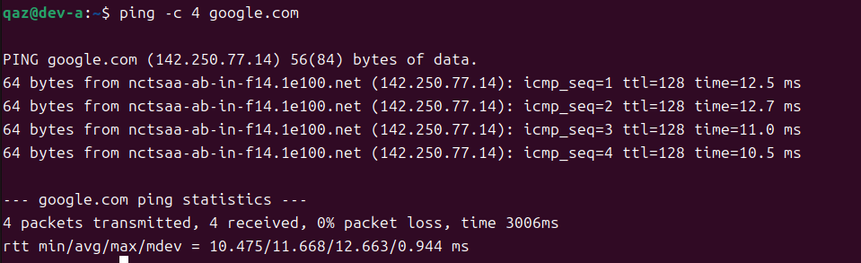
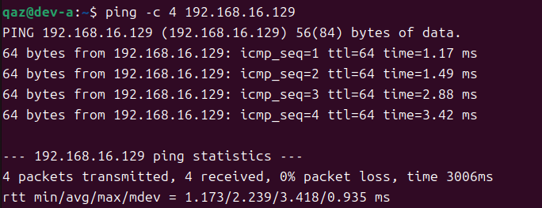
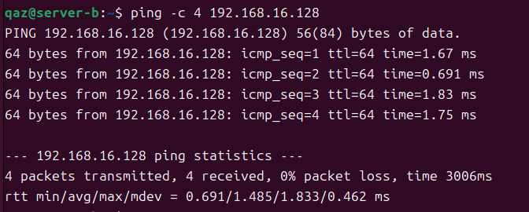
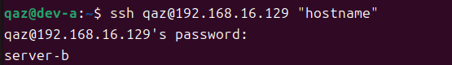
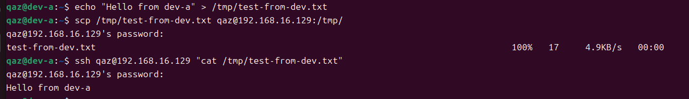
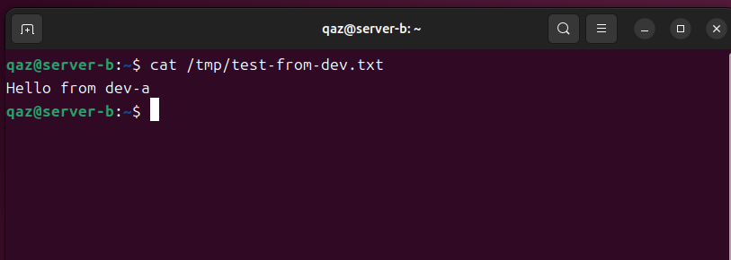
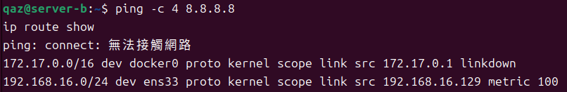

# W02｜VMware 網路模式與雙 VM 排錯

## 網路配置

| VM | 網卡 | 模式 | IP | 用途 |
|---|---|---|---|---|
| dev-a | NIC 1 | NAT | 192.168.71.130 | 上網 |
| dev-a | NIC 2 | Host-only | 192.168.16.128 | 內網互連 |
| server-b | NIC 1 | Host-only | 192.168.16.129 | 內網互連 |

## 連線驗證紀錄

- [X] dev-a NAT 可上網：`ping google.com` 輸出

  
- [X] 雙向互 ping 成功：貼上雙方 `ping` 輸出

  
  
- [X] SSH 連線成功：`ssh <user>@<ip> "hostname"` 輸出

  
- [X] SCP 傳檔成功：`cat /tmp/test-from-dev.txt` 在 server-b 上的輸出

  
  
- [X] server-b 不能上網：`ping 8.8.8.8` 失敗輸出

  

## 故障演練一：介面停用

| 項目 | 故障前 | 故障中 | 回復後 |
|---|---|---|---|
| server-b 介面狀態 | UP | DOWN | UP |
| dev-a ping server-b | 成功 | 失敗 | 成功 |
| dev-a SSH server-b | 成功 | 失敗 | 成功 |

## 故障演練二：SSH 服務停止

| 項目 | 故障前 | 故障中 | 回復後 |
|---|---|---|---|
| ss -tlnp grep :22 | 有監聽 | 無監聽 | 有監聽 |
| dev-a ping server-b | 成功 | 成功 | 成功 |
| dev-a SSH server-b | 成功 | Connection refused | 成功 |

## 排錯順序
* 依照教材的步驟，採用由下而上（L2 → L3 → L4）的分層排錯方式，依序驗證網路連線的狀態，以快速定位問題的來源。

### L2
* 首先要檢查網路介面是否存在而且為啟用狀態，並且確認是否取得正確的 IP 位址。
* 使用指令：
  ```bash
  ip address show
  ip link show
  ```
  > 如果發現介面為 DOWN 或是未取得 IPv4 位址，表示問題發生於 L2，需要檢查網卡設定或是重新啟用介面。

### L3
* 在確認網卡正常後，檢查主機是否位於同一子網，並且確認路由設定是否正確，再透過 ping 測試連通性。
* 使用指令：
  ```bash
  ip route show
  ping -c 4 <對端IP>
  ```
  > 如果 ping 無法成功，表示 L3 存在問題，可能的原因包括 IP 設定錯誤、子網不一致或是缺少路由。

### L4
* 在確認網路可 ping 成功後，檢查應用服務是否正常運作，例如: SSH 是否在監聽 port 22。
* 使用指令：
  ```bash
  ss -tlnp | grep :22
  ssh <user>@<ip> "hostname"
  ```
  > 如果 ping 成功但是 SSH 顯示「Connection refused」，表示 L4 層發生問題，需要確認 SSH 服務是否啟動。

## 網路拓樸圖
（嵌入或連結 network-diagram.png）

## 排錯紀錄
- 症狀：
- 診斷：（你首先查了什麼？用了哪個命令？）
- 修正：（做了什麼改動？）
- 驗證：（如何確認修正有效？）

## 設計決策
（說明本週至少 1 個技術選擇與取捨，例如：為什麼 server-b 只設 Host-only 不給 NAT？）
