# W03｜多 VM 架構：分層管理與最小暴露設計

## 網路配置

| VM | 角色 | 網卡 | 模式 | IP | 開放埠與來源 |
|---|---|---|---|---|---|
| bastion | 跳板機 | NIC 1 | NAT | 192.168.71.130 | SSH from any |
| bastion | 跳板機 | NIC 2 | Host-only | 192.168.16.128 | — |
| app | 應用層 | NIC 1 | Host-only | 192.168.16.129 | SSH from 192.168.16.0/24 |
| db | 資料層 | NIC 1 | Host-only | 192.168.16.130 | SSH from app + bastion |

## SSH 金鑰認證

- 金鑰類型：ed25519
- 公鑰部署到：app 和 db 的 ~/.ssh/authorized_keys
- 免密碼登入驗證：
  - bastion → app：
    
    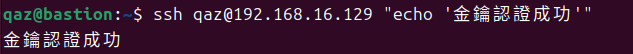
  - bastion → db：
    
    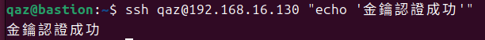

## 防火牆規則

### app 的 ufw status
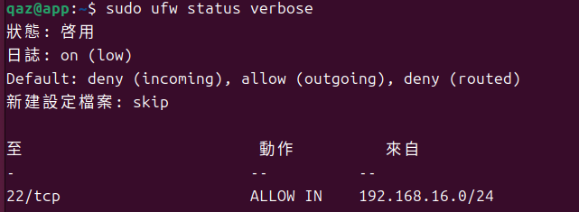

### db 的 ufw status
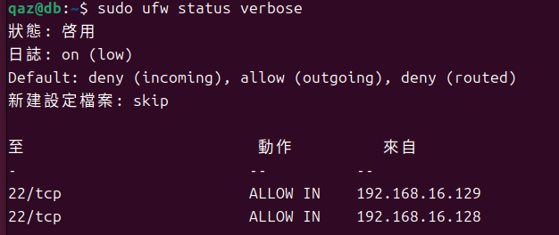

### 防火牆確實在擋的證據
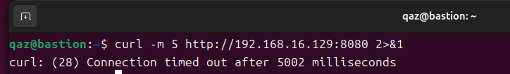

## ProxyJump 跳板連線
- 指令：
  - `ssh -J`
  ```bash
  ssh -J qaz@192.168.16.128 qaz@192.168.16.129 "hostname"
  ssh -J qaz@192.168.16.128 qaz@192.168.16.130 "hostname"
  ```
  - `SSH config 設定`
  ```bash
  Host bastion
      HostName 192.168.16.128
      User qaz

  Host app
      HostName 192.168.16.129
      User qaz
      ProxyJump bastion

  Host db
      HostName 192.168.16.130
      User qaz
      ProxyJump bastion
  ```
- 驗證輸出：
  - `ssh -J`
    
    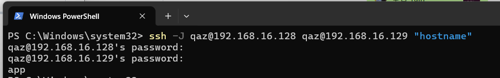
    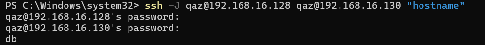
  - `SSH config`
    
    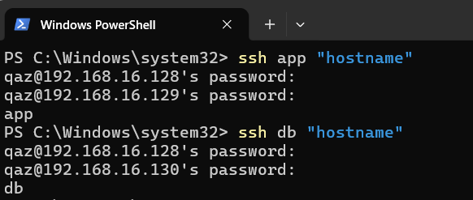
- SCP 傳檔驗證：
  
  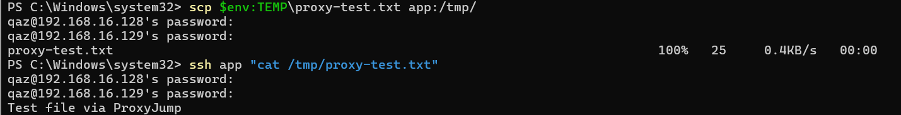
  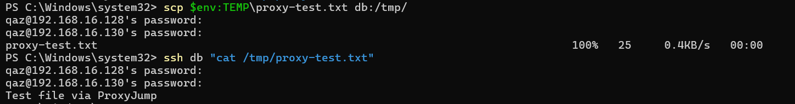

## 故障場景一：防火牆全封鎖

| 項目 | 故障前 | 故障中 | 回復後 |
|---|---|---|---|
| app ufw status | active + rules | deny all | active + rules |
| bastion ping app | 成功 | 成功 | 成功 |
| bastion SSH app | 成功 | **timed out** | 成功 |

## 故障場景二：SSH 服務停止

| 項目 | 故障前 | 故障中 | 回復後 |
|---|---|---|---|
| ss -tlnp grep :22 | 有監聽 | 無監聽 | 有監聽 |
| bastion ping app | 成功 | 成功 | 成功 |
| bastion SSH app | 成功 | **refused** | 成功 |

## timeout vs refused 差異
- Connection timed out 通常代表封包在傳輸過程中被擋掉了，像是被防火牆阻擋或網路不通，導致連線請求根本沒有成功送到目標主機，所以系統等不到回應就超時，遇到這種情況，通常會先去檢查防火牆設定或網路連線是否正常。
- Connection refused 代表封包其實已經成功到達目標主機，但是目標主機沒有在對應的埠口提供服務，所以主機直接拒絕這個連線請求，這種情況就會去檢查服務有沒有啟動，像是 ssh service 是否正在執行。
- timeout 比較像是「連不到那台機器」，而 refused 則是「連到了，但對方不讓你進 (被拒絕)」。

## 網路拓樸圖
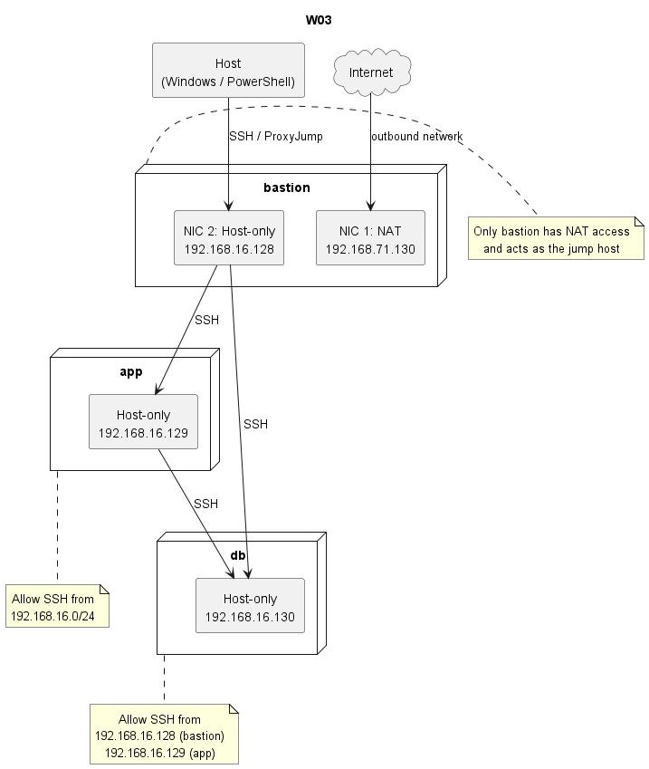

## 排錯紀錄
- 症狀：在測試 SSH 連線時，出現無法連線的情況，分別遇到 Connection timed out 與 Connection refused 的錯誤。
- 診斷：先使用 ping 確認主機之間的網路是否可達，再用 ss -tlnp | grep :22 檢查 SSH 服務是否有在監聽，同時也查看 ufw status，確認防火牆是否有阻擋連線。
- 修正：timeout 問題，發現是防火牆規則阻擋了 SSH，所以重新設定 ufw 允許正確的網段連線，refused 問題，發現是 SSH 服務被停止，透過 systemctl start ssh 重新啟動服務。
- 驗證：修正後再次從 bastion 嘗試 SSH 連線至 app，確認可以正常登入，並再次檢查 ss 與 ufw 狀態，確認服務與防火牆皆運作正常。

## 設計決策
在本次架構設計中，db 並沒有完全限制只能由 app 存取，而是同時允許 bastion 直接連線，雖然從安全角度來看，只允許 app 存取 db 可以進一步降低攻擊面，但在實務上仍然需要考量系統維運與除錯的需求，如果完全禁止 bastion 連線 db，當 app 發生問題或無法正常運作時，管理者將難以直接進入 db 進行檢查與修復，會增加排錯的複雜度，所以本設計選擇在安全性與可維運性之間取得平衡，允許 bastion 作為管理入口，確保在必要時可以直接存取 db，除此之外，透過限制來源 IP，仍然可以有效的控制存取範圍，避免 db 被其他來源直接連線，符合最小暴露原則。
