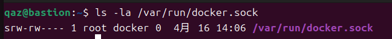
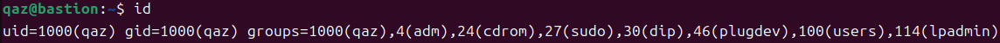
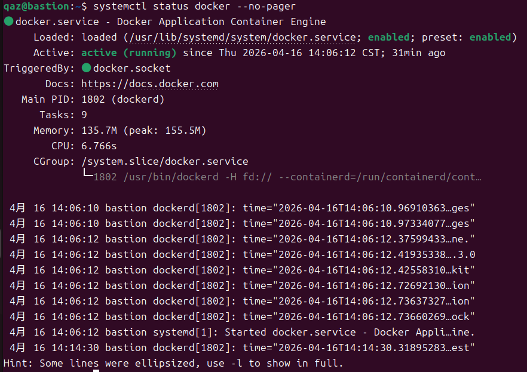
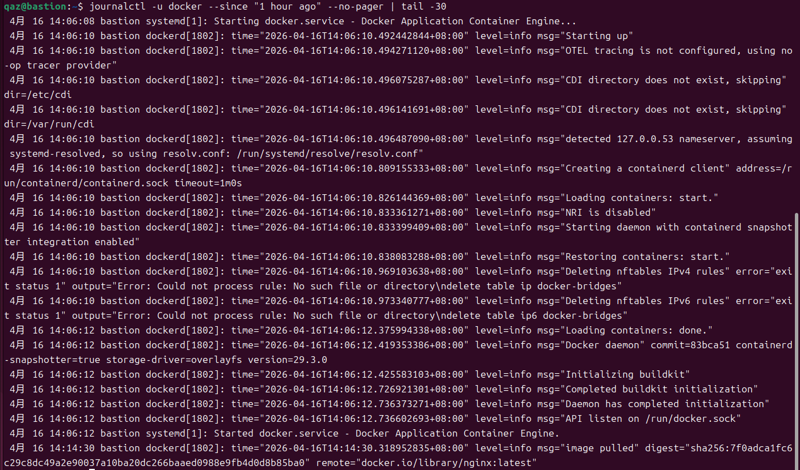
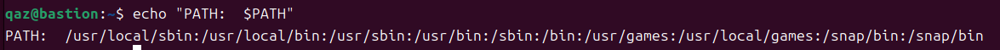

# W04｜Linux 系統基礎：檔案系統、權限、程序與服務管理

## FHS 路徑表

| FHS 路徑 | FHS 定義 | Docker 用途 |
|---|---|---|
| /etc/docker/ | 系統級設定檔目錄 | 存放 Docker daemon 設定 |
| /var/lib/docker/ | 程式的持久性狀態資料 | 存放 Docker 執行時產生的資料 |
| /usr/bin/docker | 使用者可執行檔 | Docker CLI 工具，提供使用者下指令 |
| /run/docker.sock | 執行期暫存資料 | Docker daemon 的 Unix socket，CLI 透過它與 daemon 溝通 |

## Docker 系統資訊

- Storage Driver：`overlayfs`
- Docker Root Dir：`/var/lib/docker`
- 拉取映像前 /var/lib/docker/ 大小：232K
- 拉取映像後 /var/lib/docker/ 大小：236K

## 權限結構

### Docker Socket 權限解讀


| 欄位 | 說明 |
|---|---|
| `s` | 檔案類型為 socket |
| `rw- (owner)` | 擁有者 root 具有讀寫權限 |
| `rw- (group)` | 群組 docker 成員具有讀寫權限 |
| `--- (others)` | 其他使用者沒有任何權限 |
| `root` | 檔案擁有者 |
| `docker` | 檔案所屬群組 |
| `/var/run/docker.sock` | Docker daemon 的通訊端點 |

### 使用者群組


* 目前使用者 qaz 的群組列表中**不包含 docker 群組**，這代表該使用者並沒有權限直接存取 `/var/run/docker.sock`，所以在未使用 sudo 的情況下執行 Docker 指令（例如: `docker ps`），會出現 permission denied 的錯誤。

### 安全意涵
在本次實驗中可以發現，只要使用者被加入 docker 群組，就可以直接操作 Docker daemon，而 Docker daemon 是以 root 權限執行的，也就是說，使用者雖然本身不是 root，但透過 Docker 仍然可以間接取得類似 root 的控制能力，例如: 在實驗中，可以透過 Docker 掛載主機的目錄，並且在容器內讀取這些原本只有 root 才能存取的檔案，這就表示只要能使用 Docker，就有能力接觸到系統中的敏感資料，因此，docker 群組的權限其實等同於 root，這在安全上是有風險的，如果隨意把使用者加入 docker 群組，可能會導致系統被濫用或資料外洩，綜合來看，雖然將使用者加入 docker 群組可以提升操作上的便利性，但在實際環境中仍需謹慎使用，避免違反最小權限原則。

## 程序與服務管理

### systemctl status docker


### journalctl 日誌分析

* 重點摘錄:
  ```bash
  4月 16 14:06:08 systemd[1]: Starting docker.service - Docker Application Container Engine...
  4月 16 14:06:10 dockerd[1802]: level=info msg="Starting up"
  4月 16 14:06:10 dockerd[1802]: level=info msg="Creating a containerd client"
  4月 16 14:06:10 dockerd[1802]: level=info msg="Loading containers: start."
  4月 16 14:06:10 dockerd[1802]: level=info msg="Starting daemon with containerd snapshotter integration enabled"
  4月 16 14:06:12 dockerd[1802]: level=info msg="Docker daemon"
  4月 16 14:06:12 dockerd[1802]: level=info msg="API listen on /run/docker.sock"
  4月 16 14:06:12 systemd[1]: Started docker.service - Docker Application Container Engine.
  4月 16 14:14:30 dockerd[1802]: level=info msg="image pulled" ... "nginx:latest"
  ```
* 日誌事件說明:
  ```
  從 journalctl 的輸出可以觀察到 Docker daemon 的完整啟動流程與後續操作：
  
   1. Docker 服務啟動:
    systemd 開始啟動 docker.service，並由 dockerd 程序進行初始化。
  
   2. daemon 初始化過程:
    dockerd 啟動後，建立 containerd client，並開始載入既有的 container 狀態。
  
   3. containerd 整合:
    日誌顯示 Docker 使用 containerd snapshotter，負責管理映像與容器的底層資源。
  
   4. daemon 啟動完成:
    出現 "Daemon has completed initialization"，代表 Docker 已成功啟動。
  
   5. 建立通訊端點:
    "API listen on /run/docker.sock" 表示 Docker daemon 開始監聽 socket，準備接收 CLI 指令。
  
   6. 使用者操作紀錄:
    後續出現 "image pulled" 訊息，對應使用者執行 docker pull nginx:latest，顯示操作已被 daemon 記錄。
  
  綜合來看，Docker daemon 啟動正常，且能正確處理使用者的指令並記錄於 systemd 日誌中。
  ```
  
### CLI vs Daemon 差異
Docker CLI 與 Docker daemon 在系統中扮演不同角色， Docker CLI 是使用者操作的工具，負責接收使用者輸入的指令（例如 `docker ps`、`docker run`），並將這些指令轉換成請求送給 Docker daemon ; 而 Docker daemon 則是真正負責執行工作的服務，包含建立容器、管理映像、分配資源等，並且是以 root 權限在背景運行，兩者之間的溝通是透過 `/var/run/docker.sock` 這個 Unix socket 進行的，因此 CLI 本身並不會直接操作容器，而是依賴 daemon 來完成所有實際動作，這也解釋了為什麼 `docker --version` 正常，不代表 Docker 可以正常使用，因為 `docker --version` 只是 CLI 顯示自身版本資訊，不需要與 daemon 溝通；但像 `docker ps` 或 `docker run` 這類指令，則必須透過 socket 連接 daemon，如果 daemon 沒有啟動，就會出現 Cannot connect to the Docker daemon 的錯誤，所以可以理解為：CLI 是「**發送指令的人**」，daemon 是「**實際做事的人**」，兩者缺一不可。

## 環境變數

- $PATH：
  
- which docker：`/usr/bin/docker`
- 容器內外環境變數差異觀察：Container 與 Host 的環境變數是彼此獨立的，Host 的 $PATH 會包含系統完整的執行路徑，而 Container 的 $PATH 則依映像設定，通常較精簡，且不會繼承 Host 的環境設定，這顯示容器具有獨立的執行環境。

## 故障場景一：停止 Docker Daemon

| 項目 | 故障前 | 故障中 | 回復後 |
|---|---|---|---|
| systemctl status docker | active | inactive | active |
| docker --version | 正常 | 正常 | 正常 |
| docker ps | 正常 | Cannot connect | 正常 |
| ps aux grep dockerd | 有 process | 無 process | 有 process |

## 故障場景二：破壞 Socket 權限

| 項目 | 故障前 | 故障中 | 回復後 |
|---|---|---|---|
| ls -la docker.sock 權限 | srw-rw---- | srw------- | srw-rw---- |
| docker ps（不加 sudo） | 正常 | permission denied | 正常 |
| sudo docker ps | 正常 | 正常 | 正常 |
| systemctl status docker | active | active | active |

## 錯誤訊息比較

| 錯誤訊息 | 根因 | 診斷方向 |
|---|---|---|
| Cannot connect to the Docker daemon | Docker daemon 未啟動或無法連線 | 使用 `systemctl status docker` 檢查服務狀態，必要時啟動 daemon |
| permission denied…docker.sock | 使用者沒有存取 docker.sock 的權限 | 檢查 socket 權限與使用者群組，確認是否在 docker 群組 |

* 這兩種錯誤的差異在於問題發生的層級不同，Cannot connect 表示 Docker daemon 本身沒有在運作，屬於服務層問題；而 permission denied 則表示 daemon 正常，但使用者沒有權限存取 socket，屬於權限層問題，所以排錯時，前者應優先檢查服務狀態，後者則應檢查檔案權限與使用者群組設定。

## 排錯紀錄
- 症狀：執行 `docker ps` 時出現 "permission denied while trying to connect to the Docker daemon socket"。
- 診斷：先使用 `systemctl status docker` 確認 Docker daemon 正常運行，排除服務未啟動的問題，接著使用 `ls -la /var/run/docker.sock` 檢查 socket 權限，並用 id 查看目前使用者群組，發現不在 docker 群組中。
- 修正：使用 `sudo usermod -aG docker $USER` 將使用者加入 docker 群組，並重新登入讓設定生效。
- 驗證：重新登入後再次執行 `docker ps`，不需要使用 sudo 即可正常顯示容器列表，確認問題已成功排除。

## 設計決策
本次實驗選擇使用 `usermod -aG docker $USER` 將使用者加入 docker 群組，而不是每次執行 Docker 指令都使用 sudo，這樣的好處是可以提升操作便利性，避免每次都需要輸入 sudo，使開發與測試流程更流暢，特別是在教學或練習環境中較為方便，然而，這個選擇也存在安全風險，因為 docker 群組成員可以透過 Docker daemon 間接取得 root 權限，所以實際上等同於擁有系統的完整控制權，綜合來看，在教學與開發環境中，為了方便操作可以採用加入 docker 群組的方式，但在正式或生產環境中，應該要避免隨意賦予此權限，以符合最小權限原則並降低安全風險。
