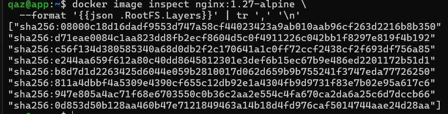
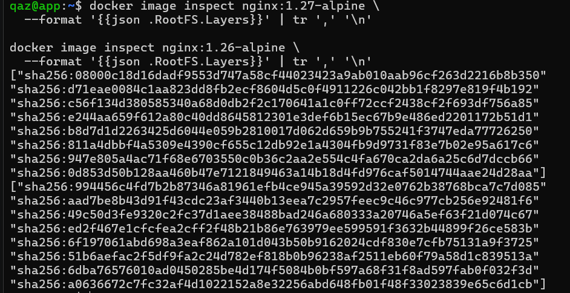
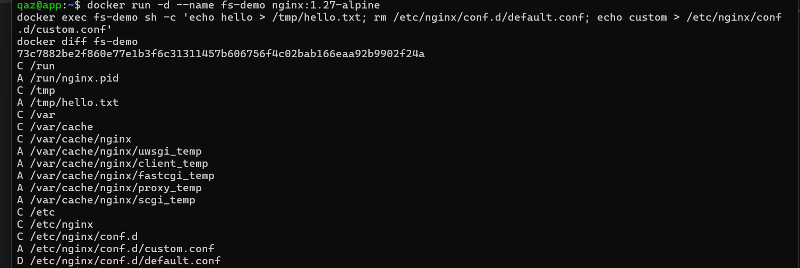

# W05｜把容器拆開來看：Namespace / Cgroups / Union FS / OCI

## Docker 環境

- Storage Driver：overlayfs
- Cgroup Version：2
- Cgroup Driver：systemd
- Default Runtime：runc

## Namespace 觀察

### 六種 namespace 用途（用自己的話）
- PID：用來隔離行程編號（Process ID），每個容器都有自己的 PID 空間，在容器內看到的 PID 1 其實只是該 namespace 的第一個行程，而不是主機的 PID 1，這也是為什麼容器內用 `ps` 只會看到少數幾個 process。
- NET：用來隔離網路資源，每個容器都有獨立的網路介面、IP 位址、路由表與 port 空間，因此不同容器之間的網路設定互不影響。
- MNT：用來隔離檔案系統的掛載點，容器內看到的根目錄 `/` 是一個獨立的 mount namespace，無法直接看到主機的檔案系統結構。
- UTS：用來隔離系統識別資訊，容器可以有自己的 hostname，而且修改後不會影響主機或其他容器。
- IPC：用來隔離行程間通訊機制，不同容器之間沒辦法直接透過這些機制互相溝通。
- USER：用來隔離使用者與權限對應，容器內的 root 可以對應到主機上的非 root 使用者，提升安全性，避免容器內的 root 擁有主機的最高權限。

### Host vs 容器 inode 對照
請參考 [`namespace-table.md`](./namespace-table.md)

### 容器內 `ps aux` 輸出
容器內執行 `ps aux` 僅觀察到少數幾個 process，例如：

- PID 1：sleep 3600（容器啟動時的主行程）
- sh（互動 shell）
- ps aux（當前查詢指令）

透過 `ps aux | wc -l` 可觀察到只有約 5 行輸出，相較於 host 上通常有數百個 process，顯示容器內只能看到極少數的行程，原因為 PID namespace 的隔離機制，容器內的 process 被放置於獨立的 PID namespace 中，因此：

- 容器內的 PID 1 並非 host 的 PID 1
- 容器無法看到 host 上的其他行程
- 同一個 process 在 host 與 container 中會有不同的 PID

所以，`ps aux` 只顯示容器內部的行程，這正是 namespace 提供「隔離」的具體證據。

## Cgroups 實驗

### 容器內讀到的限制
- memory.max：268435456
- cpu.max：50000 100000

### Host 端對照（用 `docker inspect -f '{{.HostConfig.CgroupParent}}'` 動態取得路徑）
- memory.max：268435456
- cpu.max：50000 100000
- memory.current：401408

### OOM 故障三階段
| 項目 | 故障前 | 故障中（memory=32m + dd 200m）| 回復後（memory=256m）|
|---|---|---|---|
| 容器 exit code | - | 137 | 0 |
| OOMKilled | - | true | false |
| dmesg 關鍵字 | 無 OOM | Memory cgroup out of memory | 無 OOM |

## Image 分層

### `docker image inspect nginx:1.27-alpine` layer 數量

* 共 8 層（layers）

### 兩個同源 image 共享 layer 的證據

* 觀察：
    * 教材指出，同源 image 理論上應共享底層 alpine base layer，因此前幾個 sha256 應相同，可是本次實驗結果顯示：兩個 image 的 layer sha256 並不相同，未觀察到共享 layer。

    * 可能原因為：兩個版本所使用的 alpine base image 不同，導致即使為同系列 image，layer 內容仍產生差異。這說明 Docker layer 採用 content-addressable 機制，只有在內容完全一致時，才會共享 layer。

### `docker diff` 輸出範例與解讀

* A / C / D 意義說明:
    - A（Added）：新增檔案或目錄  
    - C（Changed）：檔案或目錄內容被修改  
    - D（Deleted）：檔案被刪除  
* 實際案例解讀:
    1. **新增檔案（A）**
    - `/tmp/hello.txt`
    - `/etc/nginx/conf.d/custom.conf`

    → 這是透過 `echo` 指令在 container 中建立的新檔案。

    2. **修改目錄（C）**
    - `/etc/nginx/conf.d`
    - `/var/cache/nginx`

    → 因為目錄內有檔案新增或刪除，因此被標記為 Changed。

    3. **刪除檔案（D）**
    - `/etc/nginx/conf.d/default.conf`

    → 這是透過 `rm` 指令刪除 nginx 預設設定檔。

## OCI 呼叫鏈
### OCI 呼叫鏈
* 當我們在 terminal 輸入 `docker run` 的時候，其實後面會經過一連串元件合作來完成容器的建立。
* 首先是 **dockerd**，它會接收我們的指令（例如 `docker run`），並負責解析 image、網路、volume 等設定，不過 dockerd 本身不會直接去建立 container，而是把這些工作交給下一層的 containerd。
* 接著是 **containerd**，它負責管理 container 的生命週期，例如下載 image、建立 container、準備 root filesystem，同時它會產生一個 OCI bundle（包含 `rootfs` 和 `config.json`），然後交給 containerd-shim。
* **containerd-shim** 的角色比較像中介，它會幫忙維持 container 的執行狀態，即使 dockerd 或 containerd 關掉，container 還是可以繼續跑，因為 shim 會接手管理 container 的 process 與輸出。
* 最後是 **runc**，這才是真正負責「建立 container」的工具，它會依照 config.json 的內容，去建立 namespace、設定 cgroup、切換 root filesystem，然後啟動 container 裡的程式。
* 簡單來說：dockerd 負責接指令 → containerd 負責管理 → runc 負責實際建立 container

### OCI Runtime Spec（config.json 與 namespace / cgroup 的關係）
在 container 建立過程中，最重要的設定檔是 OCI 的 `config.json`，它定義了 container 的執行環境，首先是 namespace 的部分，在 `linux.namespaces` 裡面會定義不同種類的隔離，例如：
- pid → 行程隔離
- net → 網路隔離
- mnt → 檔案系統掛載
- ipc → 程序間通訊
- uts → hostname
- cgroup → cgroup namespace

這些會對應到我們實驗中看到的：`/proc/<PID>/ns/*`，再來是 cgroup 的設定，在 `linux.resources`：
- memory.limit → 對應 memory.max（限制記憶體）
- cpu.quota / period → 對應 cpu.max（限制 CPU）
- pids.limit → 限制 process 數量

這些就是我們在 `/sys/fs/cgroup/` 看到的那些數值來源，另外，`config.json` 裡還會有：
- root.path → container 的 root filesystem
- process.args → container 啟動時執行的指令

### 總結
`config.json` 可以看成是 container 的「說明書」： 它告訴 runc 要怎麼建立 namespace、設定 cgroup，以及最後要執行什麼程式。

## 排錯紀錄
- 症狀：在 app VM 執行 `docker pull nginx:1.27-alpine` 時出現錯誤 "failed to resolve reference "docker.io/...": dial tcp: lookup registry-1.docker.io ... i/o timeout"。
- 診斷：此錯誤表示 container 無法解析 Docker Hub 網域，進一步檢查 `/etc/resolv.conf` 發現使用的是本機 DNS（127.0.0.53），但目前 app VM 為 host-only 網路，沒有外網連線能力，因此 DNS 查詢失敗。
- 修正：改在 bastion VM（有 NAT、可上網）執行：
  ```bash
  docker pull nginx:1.27-alpine
  docker save nginx -o nginx.tar
  scp nginx.tar qaz@192.168.16.129:~
  ```
  再到 app VM 載入 image：`docker load -i nginx.tar`。
- 驗證：在 app VM 執行 `docker images` 成功看到 nginx:1.27-alpine，並可正常執行 `docker run`，確認問題已解決。

## 想一想（回答 3 題）
1. 容器裡的 PID 1 跟 host PID 1 是同一支 process 嗎？`kill -9 1`（在容器內）會發生什麼？
* 不是同一支! 容器有自己的 PID namespace，所以容器內看到的 PID 1，其實只是該 namespace 裡的第一個 process（例如 sleep 或 nginx），但在 host 上會對應到另一個 PID（例如 4119），如果在容器內執行 `kill -9 1`，會直接把容器的主 process 殺掉，container 也會因此停止（因為 PID 1 結束了）。

2. 兩個容器都基於 `ubuntu:24.04`，磁碟空間是吃兩份還是共用？怎麼驗證？
* 是共用的! Docker image 的 layer 是唯讀的，多個 container 會共享相同的 base layer，只有各自的 writable layer 才是獨立的，可以用 `docker image inspect` 看 layer，或用 `docker system df` 觀察 shared size，也可以開兩個 container 寫不同檔案，再用 `docker diff` 比較，確認只有上層不同。

3. 如果 host 的 kernel 爆漏洞，容器還能稱為「隔離」嗎？這個限制跟 VM 差在哪？
* 嚴格來說就不算完全隔離，因為 container 是共用 host 的 kernel。如果 kernel 有漏洞，攻擊者有機會從 container 逃逸到 host，跟 VM 的差別是：
    * VM 有自己的 kernel，隔離層更完整。
    * container 只是用 namespace 和 cgroup 做隔離，所以安全性比較依賴 host kernel。
