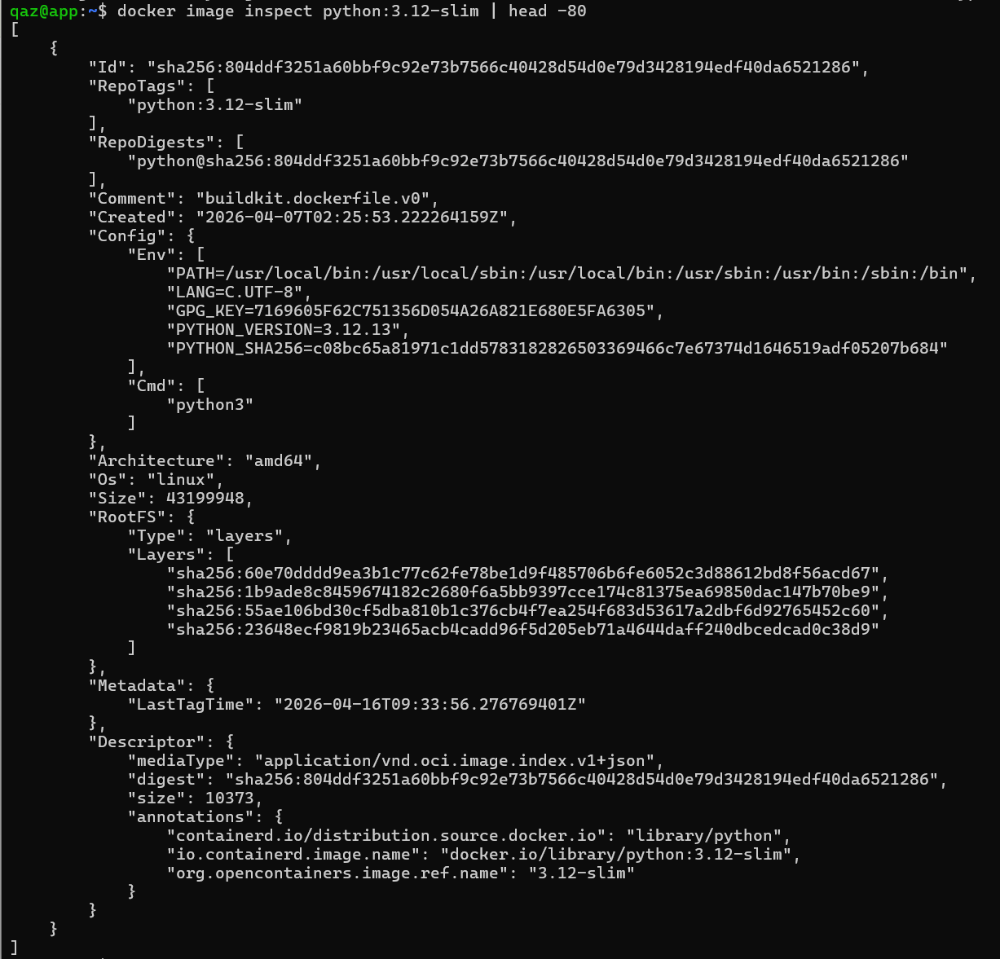

# W06｜Docker Image 與 Dockerfile

## 映像組成
- Layers 是什麼：
  Layers 可以理解成 Docker image 的一層一層檔案系統，每一層都是唯讀的，記錄某一次指令產生的變化（像是安裝套件或複製檔案），這些 layer 會一層一層疊在一起形成完整的 image，而且不同 image 之間如果有相同的 layer 是可以共用的，所以不會重複佔用空間。
- Config 是什麼：
  Config 是用來描述這個 image 要怎麼被執行的設定檔，裡面會包含像是預設指令（CMD）、環境變數（ENV）、工作目錄（WORKDIR）等資訊，簡單來說，layers 是「資料」，config 是「怎麼用這些資料跑起來」。
- Manifest 是什麼：
  Manifest 可以看成是一個索引表，它會把這個 image 用到的 layers 和 config 串在一起，記錄每一層的順序、hash 和相關資訊，Docker 在 pull image 的時候，就是先看 manifest，才知道要抓哪些 layer 組合成完整的 image。

## python:3.12-slim inspect 摘錄


- Config.Cmd：
  ["python3"] → 代表這個 image 預設啟動時會執行 `python3`，也就是直接進入 Python 環境。
- Config.Env：
  ```
  PATH=/usr/local/bin:/usr/local/sbin:/usr/local/bin:/usr/sbin:/usr/bin:/sbin:/bin  
  LANG=C.UTF-8  
  GPG_KEY=7169605F62C751356D054A26A821E680E5FA6305  
  PYTHON_VERSION=3.12.13  
  PYTHON_SHA256=c08bc65a81971c1dd5783182826503369466c7e67374d1646519adf05207b684
  ```
  → 這些環境變數主要用來設定系統語系（LANG）、執行路徑（PATH），以及 Python 的版本與驗證資訊。
  → 可以看出這個 image 在 build 時就已經把 Python 相關資訊寫進環境變數中。
- Config.WorkingDir：
  （空值）
  → 表示沒有特別設定工作目錄，預設會使用 `/`。
  → 如果在 Dockerfile 沒有指定 WORKDIR，container 啟動後就是從 root 目錄開始。
- RootFS.Layers 數量：
  4 層
  → 代表這個 image 是由 4 個唯讀 layer 組成。
  → 每一層都是一個檔案系統變化（例如安裝 Python、系統套件等），Docker 會把這些 layer 疊加起來形成完整的 image。

## Layer 快取實驗
| 情境 | build 時間 |
|---|---|
| v1 首次 build | 8.06s |
| v1 改 app.py 後 rebuild | 8.31s |
| v2 首次 build | 7.53s |
| v2 改 app.py 後 rebuild | 0.46s |

### 觀察
* 在 Dockerfile.v1 中，由於 `COPY app/ .` 位於 `pip install` 之前，當應用程式程式碼（如 `app.py`）發生變動時，會導致該層的 cache 失效，進而使後續所有 layer（包含 pip install）全部重新執行，因此 rebuild 時間與首次 build 幾乎相同（約 8 秒）。
* 在 Dockerfile.v2 中，將 `requirements.txt` 與應用程式程式碼分開處理，使依賴安裝層與應用程式層解耦，當僅修改 `app.py` 時，前面的 `COPY requirements.txt` 與 `RUN pip install` 仍可使用 cache，僅最後的 `COPY app/ .` 需要重新執行，因此 rebuild 時間大幅縮短至約 0.46 秒。
* Docker layer cache 具有「逐層依賴性」，一旦某一層發生變動，其後所有 layer 都會失效，因此在設計 Dockerfile 時，應該將變動頻率低的操作（如安裝套件）放在前面，將變動頻率高的操作（如應用程式碼）放在後面，以最大化 cache 命中率並提升建置效率。

## CMD vs ENTRYPOINT 實驗
| 寫法 | `docker run ` 輸出 | `docker run  extra1 extra2` 輸出 |
|---|---|---|
| CMD shell form | argv = ['show_args.py', 'default1', 'default2'], PID ≠ 1 | exec: "extra1": executable file not found |
| CMD exec form | argv = ['show_args.py', 'default1', 'default2'], PID = 1 | exec: "extra1": executable file not found |
| ENTRYPOINT + CMD | argv = ['show_args.py', 'default1', 'default2'], PID = 1 | argv = ['show_args.py', 'extra1', 'extra2'] |

### 結論
這次實驗可以看出，CMD 和 ENTRYPOINT 最大差別在於參數會不會被覆蓋，CMD（不管 shell 或 exec）在傳入額外參數時，原本的指令都會被取代，導致程式可能無法正常執行。而 shell form 還會多一層 `/bin/sh`，python 也不是 PID 1。ENTRYPOINT + CMD 則是固定主程式，CMD 當作預設參數，使用者輸入的參數會被「接在後面」，不會覆蓋原本指令。所以實務上通常會用 ENTRYPOINT + CMD（exec form），因為行為最穩定，也最符合預期。

## Multi-stage 大小對照
| Image | SIZE |
|---|---|
| python:3.12（builder base） | 1.62 GB |
| python:3.12-slim（runtime base） | 179 MB |
| myapp:v2（單階段） | 197 MB |
| myapp:multi（多階段） | 184 MB |

### 解釋：builder stage 的 layer 去哪了？
在 multi-stage build 中，builder stage 只是在建置時用來安裝套件或編譯程式，不會被包含在最後的 image 裡，Docker 最後只會保留 runtime stage，所以在 docker history 中看不到 builder 的那些 layer，不過這些 layer 並沒有真的消失，而是還存在於本機的 build cache（像 <untagged>），之後 build 時可以重用。

## .dockerignore 故障注入
| 項目 | 故障前 | 故障中 | 回復後 |
|---|---|---|---|
| du -sh . | 44K | 151M | 44K |
| build context 傳輸大小 | 129B | 129B | 129B |
| build 時間 | 0.516s | 0.516s | 0.499s |

## 排錯紀錄
- 症狀：執行 `docker run -d --name myapp-v1 -p 8080:80 myapp:v1` 後，使用 `curl http://localhost:8080/` 無法連線，出現 `Recv failure: 連線被對方重設`。
- 診斷：透過 `docker ps` 確認 container 已啟動，但 Flask 應用程式需要一點時間啟動，導致在服務尚未 ready 時就發送請求，另外透過 `docker logs` 可以看到 Flask server 正在啟動。
- 修正：在 container 啟動後加入短暫等待（例如 `sleep 2`），確保 Flask server 完全啟動後再進行 curl 測試。
- 驗證：重新執行 `sleep 2 && curl http://localhost:8080/`，成功取得回應 `Hello from <container-id> | version=v1`，確認服務運作正常。

## 設計決策
本次實作中，runtime image 選擇使用 `python:3.12-slim`，而不是 `alpine`，主要原因是 `python:3.12-slim` 基於 Debian，使用 glibc，相容性較高，大部分 Python 套件都可以直接安裝，不容易遇到相依性或編譯問題，相對地，`alpine` 使用 musl libc，雖然 image 體積更小，但許多 Python 套件在安裝時可能需要額外編譯或出現相容性問題，增加開發與除錯成本，在本次實驗中，重點是理解 Docker layer、multi-stage build 與執行行為，因此選擇較穩定的 `python:3.12-slim`，可以降低環境問題帶來的干擾，整體來看，這是一個在「穩定性與開發成本」與「極致體積優化」之間的取捨，本實驗選擇優先確保穩定與可預期的行為。