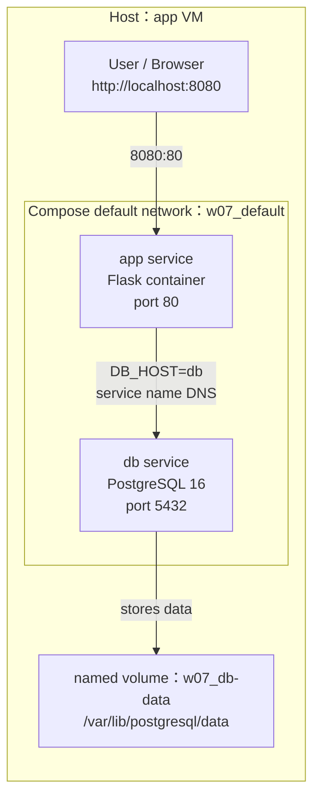

# W07｜Docker Compose 與資料持久化

## 拓樸圖


## 從 docker run 到 compose.yaml
我覺得從 `docker run` 改成 `compose.yaml` 之後，最有感的地方是整個部署流程變得比較好整理，也比較不容易漏掉設定。

以前如果用三條 `docker run` 來啟動服務，就要自己記得先建立 network、再啟動 db、再啟動 app，而且環境變數、port、volume 都分散在不同指令裡，如果之後要重做一次，很容易少打一個參數或是忘記資料庫的 volume 要掛在哪裡。

改用 Docker Compose 之後，我只要把 app、db、port、環境變數和 volume 都寫在同一份 `compose.yaml` 裡，之後就可以用一行 `docker compose up -d` 把整組服務一起啟動，這樣不只比較清楚，也比較方便給別人重現同樣的環境。

對我來說，Compose 最大的改善就是把原本零散的指令變成一份可以保存、可以重跑的設定檔，整個操作比較有規劃，也比較不容易出錯。

## 三種掛載對照
| 掛載類型 | 路徑（host） | 容器砍重起資料還在嗎 | 重啟容器資料狀態 | 適合情境 |
|---|---|---|---|---|
| named volume | Docker 管理的 `/var/lib/docker/volumes/w07_db-data/_data` |  還在，只要沒有使用 `docker compose down -v` 刪掉 volume | 資料會保留，重新啟動 db 後還能讀到原本資料 | 適合存資料庫資料，例如 PostgreSQL 的 `/var/lib/postgresql/data` |
| bind mount | 專案目錄中的 `./app`，也就是 `~/virt-container-labs/w07/app` | 還在，因為資料實際放在 host 的資料夾裡 | host 上的檔案會直接同步到容器，重啟後還是看得到 | 適合開發時掛載程式碼，方便修改 `app.py` |
| tmpfs | 不會存在一般 host 路徑，資料放在記憶體中，例如容器內 `/tmp/cache` | 不在，容器停止或重啟後資料就會消失 | 重啟後資料會清空，不會保留下來 | 適合暫存資料、快取或不想留在硬碟上的敏感資料 |

## healthcheck 前後對照
|      寫法       | curl /healthz t=1s | t=3s | t=5s | t=10s |
|:---------------:|:------------------:|:----:|:----:|:-----:|
|  只 depends_on  |        503         | 503  | 503  |  200  |
| service_healthy |        000         | 200  | 200  |  200  |

觀察：

只使用 `depends_on` 的時候，Compose 只會確認 db 容器有啟動，但不代表資料庫已經可以連線，所以 app 可能會太早啟動，導致一開始打 `/healthz` 時出現 503，代表 app 已經起來了，但是還連不到 db。

改成 `service_healthy` 之後，app 會等 db 通過 healthcheck 才啟動。這時候一開始可能會看到 000，代表 app 還沒有開始對外提供服務，但是只要 app 啟動成功，`/healthz` 就會直接回 200，對我來說，這樣比較穩定，因為 app 不會在 db 還沒準備好時就先跑起來。

## 排錯紀錄
- 症狀：一開始在 `~/virt-container-labs/w07` 執行 `docker compose config` 時，出現 `no configuration file provided: not found`，代表 Docker Compose 找不到設定檔。
- 診斷：這個錯誤通常表示目前目錄下沒有 `compose.yaml`，或是檔案名稱打錯，因為 Compose 預設會在目前資料夾尋找 `compose.yaml`，如果檔案不存在，就無法解析服務設定。
- 修正：我先用 `pwd` 確認自己在 `~/virt-container-labs/w07` 目錄下，再用 `ls -la` 檢查檔案，確認缺少 `compose.yaml` 後，重新建立 `compose.yaml`，並把 app、db、volume、environment 和 depends_on 設定寫進去。
- 驗證：重新執行 `docker compose config` 後，成功看到 `app`、`db`、`w07_default` network 和 `w07_db-data` volume 的設定，接著執行 `docker compose up -d --build`，服務成功啟動，再用 `curl http://localhost:8080/healthz` 測試，回傳 `ok`，表示修正成功。

## 設計決策
這次我讓 db 使用 named volume，而不是 bind mount，主要是因為資料庫資料比較重要，應該交給 Docker 統一管理，PostgreSQL 的資料會存在容器內的 `/var/lib/postgresql/data`，如果沒有掛載 volume，容器被刪掉後資料可能就會一起消失，使用 named volume `db-data` 之後，就算重新建立 db 容器，只要沒有執行 `docker compose down -v`，資料還是會保留下來。

我沒有選擇 bind mount 來存資料庫，是因為 bind mount 比較適合用在開發程式碼，例如把 host 的 `./app` 掛進容器，方便修改 `app.py`，但資料庫資料夾會有權限、檔案格式和資料一致性的問題，如果直接用 host 目錄去掛，之後移到別台機器或換環境時比較容易出錯。

tmpfs 則不適合用在生產環境的資料庫，因為 tmpfs 是存在記憶體裡，容器停止或主機重開後資料就會消失，資料庫最重要的是資料要能長期保存，所以 tmpfs 只適合放暫存資料、cache 或是不想留在硬碟上的短期資料，不適合拿來存正式的 PostgreSQL 資料。

## 可重跑最小命令鏈
如果要重新啟動本週的 Compose 專案，可以使用以下指令：
```bash
cd ~/virt-container-labs/w07
cp .env.example .env 
docker compose up -d
sleep 10
curl http://localhost:8080/healthz
```
